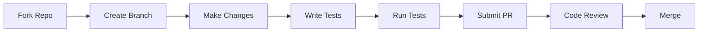

# Contributing to Adaptive Deployment Orchestrator

Thank you for your interest in contributing to the Adaptive Deployment Orchestrator! This document provides guidelines and instructions for contributing.

## Code of Conduct

By participating in this project, you agree to abide by our Code of Conduct. Please be respectful and constructive in all interactions.

## How to Contribute

### Reporting Issues

1. **Check existing issues** - Search the issue tracker to see if your issue has already been reported
2. **Create a new issue** - If not found, create a new issue with:
   - Clear, descriptive title
   - Detailed description of the problem
   - Steps to reproduce
   - Expected vs actual behavior
   - Environment details (OS, versions, etc.)

### Suggesting Features

1. **Check existing feature requests** - Search for similar suggestions
2. **Open a feature request** with:
   - Clear description of the feature
   - Use case and motivation
   - Proposed implementation (if any)

### Pull Requests



#### Process

1. **Fork the repository**
2. **Create a feature branch**
   ```bash
   git checkout -b feature/your-feature-name
   ```
3. **Make your changes**
4. **Write/update tests**
5. **Run tests locally**
   ```bash
   # Backend tests
   cd backend
   pytest tests/

   # Frontend tests
   cd frontend
   npm test
   ```
6. **Commit with clear messages**
   ```bash
   git commit -m "feat: add new deployment strategy option"
   ```
7. **Push and create PR**
   ```bash
   git push origin feature/your-feature-name
   ```

## Development Setup

### Prerequisites

- Python 3.11+
- Node.js 18+
- Docker and Docker Compose
- PostgreSQL 15+ (or use Docker)

### Backend Development

```bash
cd backend
python -m venv venv
source venv/bin/activate
pip install -r requirements.txt
pip install -r requirements-dev.txt

# Run tests
pytest tests/

# Run linting
flake8 app/
black app/ --check
mypy app/

# Start development server
uvicorn app.main:app --reload
```

### Frontend Development

```bash
cd frontend
npm install

# Run tests
npm test

# Run linting
npm run lint

# Type checking
npm run type-check

# Start development server
npm run dev
```

### CLI Development

```bash
cd cli
pip install -e .

# Test CLI
adaptive-deploy --help
```

## Coding Standards

### Python (Backend)

- Follow PEP 8 style guide
- Use type hints
- Write docstrings for public functions
- Maximum line length: 100 characters

```python
async def create_deployment(
    service_name: str,
    version: str,
    strategy: DeploymentStrategy
) -> Deployment:
    """
    Create a new deployment.

    Args:
        service_name: Name of the service to deploy
        version: Target version
        strategy: Deployment strategy (canary or blue_green)

    Returns:
        Created deployment object

    Raises:
        ValueError: If invalid parameters provided
    """
    ...
```

### TypeScript (Frontend)

- Use functional components with hooks
- Strict TypeScript mode
- Use interfaces for type definitions
- Follow React best practices

```typescript
interface DeploymentProps {
  deploymentId: string;
  onStatusChange?: (status: DeploymentStatus) => void;
}

const DeploymentCard: React.FC<DeploymentProps> = ({
  deploymentId,
  onStatusChange
}) => {
  // Component implementation
};
```

### Commit Messages

Follow conventional commits format:

```
type(scope): description

[optional body]

[optional footer]
```

Types:
- `feat`: New feature
- `fix`: Bug fix
- `docs`: Documentation
- `style`: Formatting
- `refactor`: Code restructuring
- `test`: Adding tests
- `chore`: Maintenance

Examples:
```
feat(api): add deployment pause endpoint
fix(dashboard): correct traffic percentage display
docs(readme): update installation instructions
test(orchestrator): add rollback scenario tests
```

## Testing

### Backend Tests

```bash
cd backend

# Run all tests
pytest tests/

# Run with coverage
pytest tests/ --cov=app --cov-report=html

# Run specific test
pytest tests/test_orchestrator.py -v
```

### Frontend Tests

```bash
cd frontend

# Run all tests
npm test

# Run with coverage
npm test -- --coverage

# Run specific test
npm test -- --testPathPattern=DeploymentCard
```

## Documentation

- Update documentation when changing features
- Add docstrings to new functions
- Update README if adding major features
- Include Mermaid diagrams for complex flows

## Review Process

1. **Automated checks** - CI must pass
2. **Code review** - At least one approval required
3. **Documentation** - Ensure docs are updated
4. **Testing** - Adequate test coverage

## Questions?

- Open a discussion in GitHub Discussions
- Ask in pull request comments
- Contact maintainers

Thank you for contributing! 🎉
