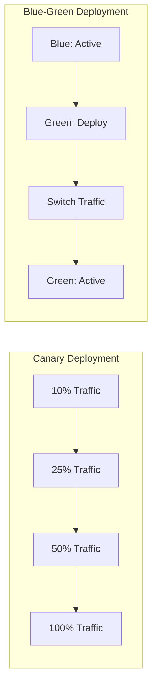
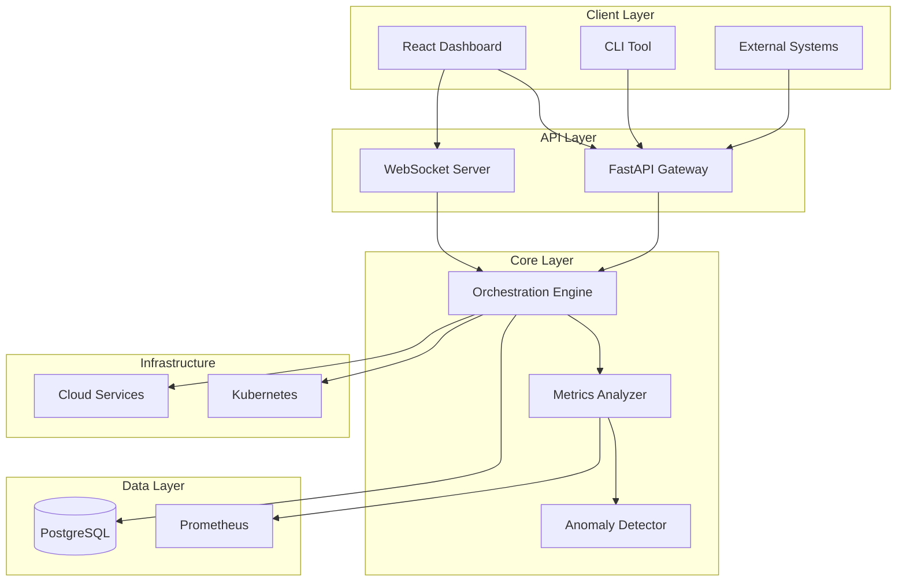
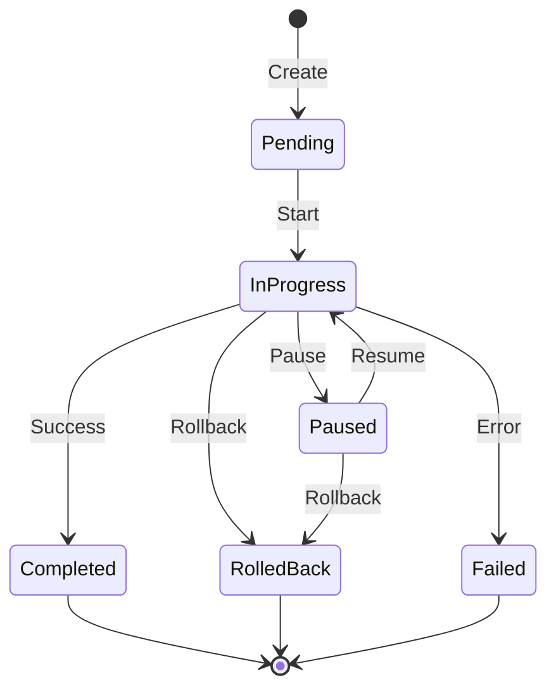

# Adaptive Deployment Orchestrator

A production-grade, intelligent deployment orchestration platform with real-time control dashboard for Blue-Green and Canary deployments.

[](https://opensource.org/licenses/MIT)
[](https://www.python.org/downloads/)
[](https://reactjs.org/)
[](https://fastapi.tiangolo.com/)

## Features

- **Intelligent Deployment Strategies**: Blue-Green and Canary rollouts with automated traffic control
- **AI-Driven Decision Engine**: Metric-based anomaly detection and automated rollback
- **Real-Time Dashboard**: Interactive web UI with live deployment visualization and controls
- **Comprehensive API**: REST + WebSocket endpoints for automation and real-time updates
- **CLI Tool**: Command-line interface for operators and CI/CD integration
- **Enterprise Security**: JWT authentication, RBAC, audit logging
- **Production Observability**: OpenTelemetry, Prometheus metrics, structured logging
- **CI/CD Ready**: GitHub Actions and GitLab pipeline examples

## Deployment Strategies



## Quick Start

### Using Docker Compose (Recommended)

```bash
# Start all services
docker-compose up -d

# Access the dashboard
open http://localhost:3000

# Access the API docs
open http://localhost:8000/docs
```

### Local Development

#### Backend Setup

```bash
cd backend
python -m venv venv
source venv/bin/activate  # On Windows: venv\Scripts\activate
pip install -r requirements.txt
uvicorn app.main:app --reload
```

#### Frontend Setup

```bash
cd frontend
npm install
npm run dev
```

#### CLI Tool

```bash
cd cli
pip install -e .
adaptive-deploy --help
```

## Architecture

See [ARCHITECTURE.md](./docs/ARCHITECTURE.md) for detailed system design.



### Key Components

| Component | Technology | Purpose |
|-----------|-----------|---------|
| API Gateway | FastAPI | REST API & WebSocket server |
| Dashboard | React 18 + TypeScript | Real-time deployment UI |
| CLI | Python + Click | Command-line operations |
| Database | PostgreSQL | Deployment state & audit logs |
| Metrics | Prometheus | Time-series monitoring |
| Container | Docker + Kubernetes | Container orchestration |

## Documentation

- [Architecture Guide](./docs/ARCHITECTURE.md)
- [API Reference](./docs/API.md)
- [Dashboard User Guide](./docs/DASHBOARD.md)
- [CLI Reference](./docs/CLI.md)
- [Deployment Guide](./docs/DEPLOYMENT.md)
- [CI/CD Integration](./docs/CICD.md)
- [Security Best Practices](./docs/SECURITY.md)

## Project Structure

```
adaptive-deployment-orchestrator/
├── backend/              # FastAPI backend service
│   ├── app/
│   │   ├── api/         # API endpoints
│   │   ├── core/        # Core orchestration engine
│   │   ├── models/      # Database models
│   │   ├── services/    # Business logic services
│   │   └── main.py      # Application entry point
│   ├── tests/           # Backend tests
│   └── requirements.txt
├── frontend/            # React TypeScript dashboard
│   ├── src/
│   │   ├── components/  # React components
│   │   ├── services/    # API clients
│   │   └── App.tsx
│   └── package.json
├── cli/                 # CLI tool
│   ├── adaptive_deploy/
│   └── setup.py
├── docs/                # Documentation
├── pipelines/           # CI/CD examples
│   ├── github-actions/
│   └── gitlab/
├── docker-compose.yml
└── README.md
```

## Usage Examples

### Deploy with Canary Strategy

```bash
# Using CLI
adaptive-deploy canary \
  --service news-api \
  --version v2.0.0 \
  --steps 10,25,50,100 \
  --metric error_rate \
  --threshold 0.05

# Using API
curl -X POST http://localhost:8000/api/v1/deployments \
  -H "Authorization: Bearer $TOKEN" \
  -d '{
    "service": "news-api",
    "strategy": "canary",
    "version": "v2.0.0",
    "steps": [10, 25, 50, 100],
    "metrics": {
      "error_rate": {"threshold": 0.05}
    }
  }'
```

### Monitor and Control Deployments

```bash
# Check deployment status
adaptive-deploy status --deployment news-api-canary

# Pause a rollout
adaptive-deploy pause --deployment news-api-canary

# Resume rollout
adaptive-deploy resume --deployment news-api-canary

# Rollback
adaptive-deploy rollback --deployment news-api-canary
```

## Deployment Lifecycle



## Production Readiness

### Security Features
- ✅ JWT authentication with configurable expiration
- ✅ Role-Based Access Control (RBAC)
- ✅ Audit logging for all operations
- ✅ Input validation and sanitization
- ✅ CORS configuration
- ✅ Rate limiting

### Observability
- ✅ Prometheus metrics endpoint
- ✅ Structured JSON logging
- ✅ Health and readiness probes
- ✅ OpenTelemetry support
- ✅ Real-time event streaming

### Reliability
- ✅ Database connection pooling
- ✅ Automatic retry with backoff
- ✅ Graceful error handling
- ✅ Idempotent operations

## Contributing

We welcome contributions! Please see our [Contributing Guide](CONTRIBUTING.md) for details.

1. Fork the repository
2. Create a feature branch
3. Make your changes
4. Submit a pull request

## License

MIT License - See [LICENSE](./LICENSE) for details

---

**Built for production. Ready to deploy. Built for scale.**
