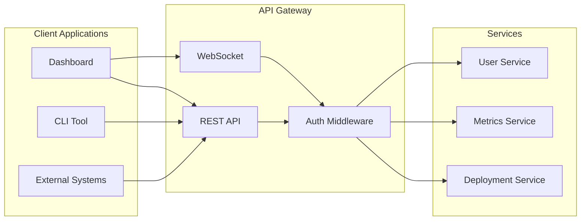
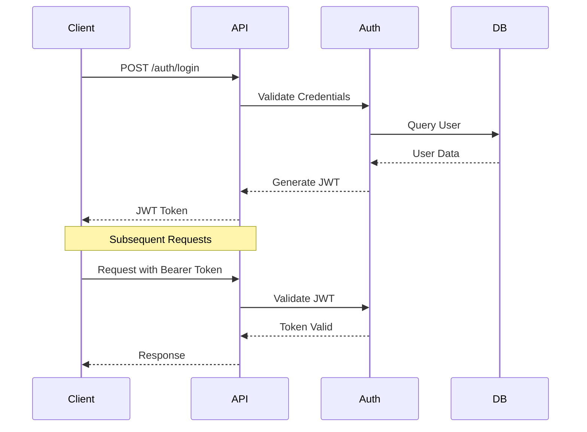
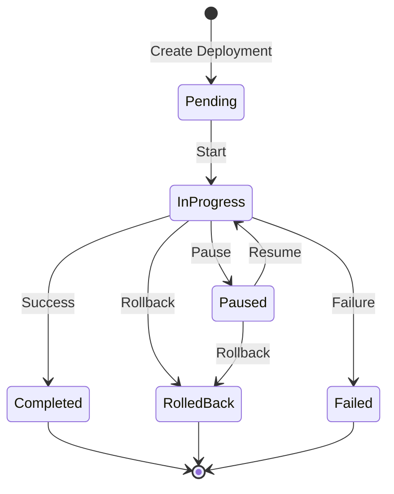
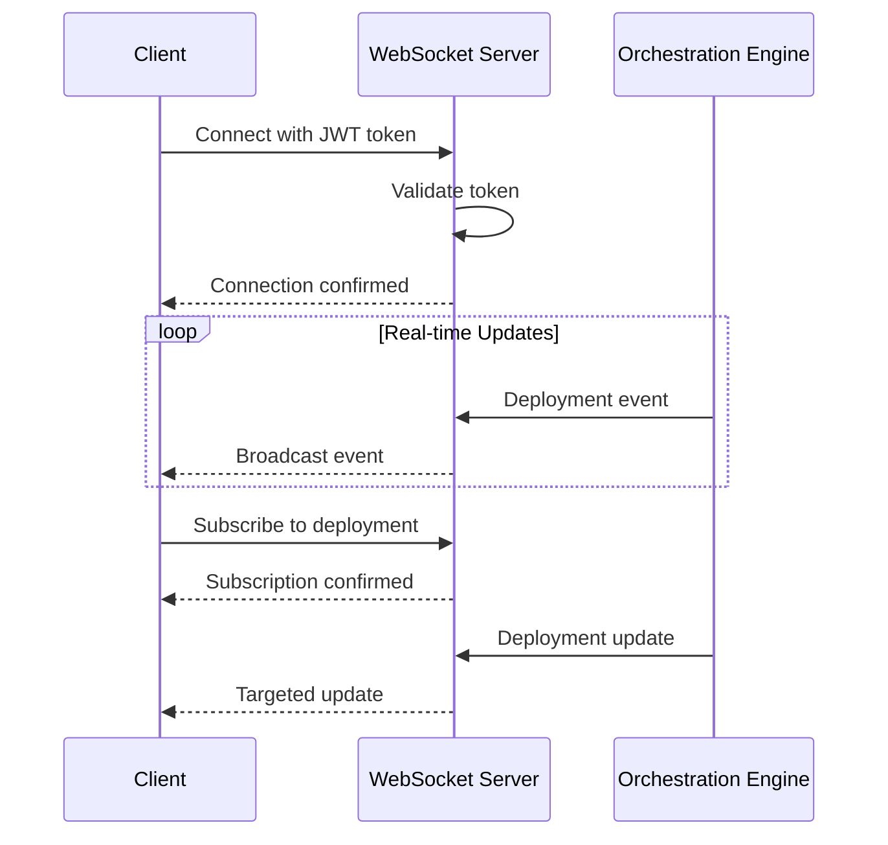

# API Reference

Complete REST API reference for the Adaptive Deployment Orchestrator.

## Overview

The API provides RESTful endpoints for managing deployments, authentication, and monitoring. It uses JWT-based authentication and supports WebSocket connections for real-time updates.



## Base URL

```
Production: https://api.yourdomain.com
Development: http://localhost:8000
```

## Authentication

All API endpoints (except `/health` and `/auth/login`) require JWT authentication.

### Authentication Flow



### Request Headers

```http
Authorization: Bearer <your-jwt-token>
Content-Type: application/json
```

---

## Authentication Endpoints

### Login

Authenticate user and obtain JWT token.

```http
POST /api/v1/auth/login
```

**Request Body:**

| Field | Type | Required | Description |
|-------|------|----------|-------------|
| `username` | string | Yes | User's username |
| `password` | string | Yes | User's password |

**Example Request:**

```bash
curl -X POST http://localhost:8000/api/v1/auth/login \
  -H "Content-Type: application/json" \
  -d '{
    "username": "admin",
    "password": "admin123"
  }'
```

**Success Response (200 OK):**

```json
{
  "access_token": "eyJhbGciOiJIUzI1NiIsInR5cCI6IkpXVCJ9...",
  "token_type": "bearer",
  "expires_in": 3600
}
```

**Error Response (401 Unauthorized):**

```json
{
  "detail": "Incorrect username or password"
}
```

---

### Register User

Register a new user (admin only).

```http
POST /api/v1/auth/register
```

**Request Body:**

| Field | Type | Required | Description |
|-------|------|----------|-------------|
| `username` | string | Yes | Username (3-100 characters) |
| `email` | string | Yes | Valid email address |
| `password` | string | Yes | Password (min 8 characters) |
| `role` | string | No | User role: `admin`, `operator`, `viewer` (default: `operator`) |

**Example Request:**

```bash
curl -X POST http://localhost:8000/api/v1/auth/register \
  -H "Authorization: Bearer $TOKEN" \
  -H "Content-Type: application/json" \
  -d '{
    "username": "newoperator",
    "email": "operator@example.com",
    "password": "securepassword123",
    "role": "operator"
  }'
```

**Success Response (201 Created):**

```json
{
  "id": 2,
  "username": "newoperator",
  "email": "operator@example.com",
  "role": "operator",
  "is_active": true,
  "created_at": "2024-01-01T12:00:00Z",
  "last_login": null
}
```

---

### Get Current User

Get current authenticated user's information.

```http
GET /api/v1/auth/me
```

**Example Request:**

```bash
curl http://localhost:8000/api/v1/auth/me \
  -H "Authorization: Bearer $TOKEN"
```

**Success Response (200 OK):**

```json
{
  "id": 1,
  "username": "admin",
  "email": "admin@example.com",
  "role": "admin",
  "is_active": true,
  "created_at": "2024-01-01T00:00:00Z",
  "last_login": "2024-01-01T12:00:00Z"
}
```

---

### Logout

Logout current user session.

```http
POST /api/v1/auth/logout
```

**Example Request:**

```bash
curl -X POST http://localhost:8000/api/v1/auth/logout \
  -H "Authorization: Bearer $TOKEN"
```

**Success Response (200 OK):**

```json
{
  "message": "Successfully logged out"
}
```

---

## Deployment Endpoints

### Deployment Lifecycle



### Create Deployment

Create a new deployment with specified strategy.

```http
POST /api/v1/deployments
```

**Request Body:**

| Field | Type | Required | Description |
|-------|------|----------|-------------|
| `service_name` | string | Yes | Name of the service to deploy |
| `environment` | string | Yes | `development`, `staging`, or `production` |
| `strategy` | string | Yes | `blue_green` or `canary` |
| `target_version` | string | Yes | Version to deploy |
| `namespace` | string | No | Kubernetes namespace (default: `default`) |
| `canary_steps` | array | No | Traffic steps for canary (default: `[10, 25, 50, 100]`) |
| `metrics_config` | object | No | Metrics thresholds for health checks |
| `metadata` | object | No | Additional metadata |

**Metrics Config Schema:**

```json
{
  "error_rate": {
    "threshold": 0.05,
    "comparison": "less_than",
    "window": 60
  },
  "latency_p99": {
    "threshold": 1000,
    "comparison": "less_than",
    "window": 60
  }
}
```

**Example Request (Canary):**

```bash
curl -X POST http://localhost:8000/api/v1/deployments \
  -H "Authorization: Bearer $TOKEN" \
  -H "Content-Type: application/json" \
  -d '{
    "service_name": "news-api",
    "environment": "production",
    "strategy": "canary",
    "target_version": "v2.0.0",
    "canary_steps": [10, 25, 50, 100],
    "metrics_config": {
      "error_rate": {"threshold": 0.05},
      "latency_p99": {"threshold": 1000}
    }
  }'
```

**Example Request (Blue-Green):**

```bash
curl -X POST http://localhost:8000/api/v1/deployments \
  -H "Authorization: Bearer $TOKEN" \
  -H "Content-Type: application/json" \
  -d '{
    "service_name": "news-api",
    "environment": "production",
    "strategy": "blue_green",
    "target_version": "v2.0.0"
  }'
```

**Success Response (201 Created):**

```json
{
  "id": 1,
  "deployment_id": "news-api-canary-20240101120000",
  "service_name": "news-api",
  "environment": "production",
  "strategy": "canary",
  "status": "pending",
  "current_version": "v1.0.0",
  "target_version": "v2.0.0",
  "current_step": 0,
  "current_traffic_percentage": 0.0,
  "canary_steps": [10, 25, 50, 100],
  "active_slot": null,
  "created_at": "2024-01-01T12:00:00Z",
  "started_at": null,
  "completed_at": null,
  "updated_at": null,
  "error_message": null,
  "rollback_reason": null,
  "created_by": "admin",
  "metadata": {}
}
```

---

### List Deployments

List deployments with optional filtering and pagination.

```http
GET /api/v1/deployments
```

**Query Parameters:**

| Parameter | Type | Description |
|-----------|------|-------------|
| `service_name` | string | Filter by service name |
| `environment` | string | Filter by environment |
| `status` | string | Filter by status |
| `page` | integer | Page number (default: 1) |
| `page_size` | integer | Results per page (1-100, default: 50) |

**Example Request:**

```bash
curl "http://localhost:8000/api/v1/deployments?service_name=news-api&status=in_progress" \
  -H "Authorization: Bearer $TOKEN"
```

**Success Response (200 OK):**

```json
{
  "total": 25,
  "page": 1,
  "page_size": 50,
  "deployments": [
    {
      "id": 1,
      "deployment_id": "news-api-canary-20240101120000",
      "service_name": "news-api",
      "environment": "production",
      "strategy": "canary",
      "status": "in_progress",
      "current_traffic_percentage": 25.0,
      ...
    }
  ]
}
```

---

### Get Deployment Details

Get detailed information about a specific deployment.

```http
GET /api/v1/deployments/{deployment_id}
```

**Path Parameters:**

| Parameter | Type | Description |
|-----------|------|-------------|
| `deployment_id` | string | Unique deployment identifier |

**Example Request:**

```bash
curl http://localhost:8000/api/v1/deployments/news-api-canary-20240101120000 \
  -H "Authorization: Bearer $TOKEN"
```

**Success Response (200 OK):**

```json
{
  "id": 1,
  "deployment_id": "news-api-canary-20240101120000",
  "service_name": "news-api",
  "environment": "production",
  "strategy": "canary",
  "status": "in_progress",
  "current_version": "v1.0.0",
  "target_version": "v2.0.0",
  "current_step": 2,
  "current_traffic_percentage": 25.0,
  "canary_steps": [10, 25, 50, 100],
  "active_slot": null,
  "created_at": "2024-01-01T12:00:00Z",
  "started_at": "2024-01-01T12:01:00Z",
  "completed_at": null,
  "updated_at": "2024-01-01T12:15:00Z",
  "error_message": null,
  "rollback_reason": null,
  "created_by": "admin",
  "metadata": {
    "commit_sha": "abc123",
    "pipeline_id": "12345"
  }
}
```

**Error Response (404 Not Found):**

```json
{
  "detail": "Deployment news-api-canary-20240101120000 not found"
}
```

---

### Start Deployment

Start the deployment execution process.

```http
POST /api/v1/deployments/{deployment_id}/start
```

**Example Request:**

```bash
curl -X POST http://localhost:8000/api/v1/deployments/news-api-canary-20240101120000/start \
  -H "Authorization: Bearer $TOKEN"
```

**Success Response (200 OK):**

Returns the updated deployment object with `status: "in_progress"`.

---

### Control Deployment

Control a deployment with actions: pause, resume, rollback, promote, switch.

```http
POST /api/v1/deployments/{deployment_id}/control
```

**Request Body:**

| Field | Type | Required | Description |
|-------|------|----------|-------------|
| `action` | string | Yes | Control action: `pause`, `resume`, `rollback`, `promote`, `switch` |
| `reason` | string | No | Reason for the action |

**Control Actions:**

| Action | Description | Valid States |
|--------|-------------|--------------|
| `pause` | Pause deployment at current step | `in_progress` |
| `resume` | Resume paused deployment | `paused` |
| `rollback` | Rollback to previous version | `in_progress`, `paused` |
| `promote` | Promote to 100% immediately | `in_progress`, `paused` |
| `switch` | Switch blue/green slots | `in_progress` (blue_green only) |

**Example Request (Pause):**

```bash
curl -X POST http://localhost:8000/api/v1/deployments/news-api-canary-20240101120000/control \
  -H "Authorization: Bearer $TOKEN" \
  -H "Content-Type: application/json" \
  -d '{
    "action": "pause",
    "reason": "Investigating metric anomaly"
  }'
```

**Example Request (Rollback):**

```bash
curl -X POST http://localhost:8000/api/v1/deployments/news-api-canary-20240101120000/control \
  -H "Authorization: Bearer $TOKEN" \
  -H "Content-Type: application/json" \
  -d '{
    "action": "rollback",
    "reason": "High error rate detected"
  }'
```

---

### Get Deployment History

Get state change history for a deployment.

```http
GET /api/v1/deployments/{deployment_id}/history
```

**Example Request:**

```bash
curl http://localhost:8000/api/v1/deployments/news-api-canary-20240101120000/history \
  -H "Authorization: Bearer $TOKEN"
```

**Success Response (200 OK):**

```json
[
  {
    "id": 3,
    "from_status": "pending",
    "to_status": "in_progress",
    "from_traffic_percentage": 0,
    "to_traffic_percentage": 10,
    "changed_by": "admin",
    "reason": "Deployment started",
    "timestamp": "2024-01-01T12:01:00Z",
    "metadata": {}
  },
  {
    "id": 4,
    "from_status": "in_progress",
    "to_status": "in_progress",
    "from_traffic_percentage": 10,
    "to_traffic_percentage": 25,
    "changed_by": "system",
    "reason": "Metrics healthy, proceeding to next step",
    "timestamp": "2024-01-01T12:15:00Z",
    "metadata": {}
  }
]
```

---

### Get Deployment Events

Get event log for a deployment.

```http
GET /api/v1/deployments/{deployment_id}/events
```

**Query Parameters:**

| Parameter | Type | Description |
|-----------|------|-------------|
| `limit` | integer | Maximum events to return (1-1000, default: 100) |

**Example Request:**

```bash
curl "http://localhost:8000/api/v1/deployments/news-api-canary-20240101120000/events?limit=50" \
  -H "Authorization: Bearer $TOKEN"
```

**Success Response (200 OK):**

```json
[
  {
    "id": 1,
    "deployment_id": 1,
    "event_type": "deployment_started",
    "severity": "info",
    "message": "Deployment started by admin",
    "timestamp": "2024-01-01T12:01:00Z",
    "actor": "admin",
    "details": {}
  },
  {
    "id": 2,
    "deployment_id": 1,
    "event_type": "traffic_shift",
    "severity": "info",
    "message": "Traffic shifted to 10%",
    "timestamp": "2024-01-01T12:02:00Z",
    "actor": "system",
    "details": {"from": 0, "to": 10}
  },
  {
    "id": 3,
    "deployment_id": 1,
    "event_type": "metrics_check",
    "severity": "info",
    "message": "Metrics check passed",
    "timestamp": "2024-01-01T12:05:00Z",
    "actor": "system",
    "details": {"error_rate": 0.01, "threshold": 0.05}
  }
]
```

---

### Get Deployment Metrics

Get metrics data for a deployment.

```http
GET /api/v1/deployments/{deployment_id}/metrics
```

**Query Parameters:**

| Parameter | Type | Description |
|-----------|------|-------------|
| `metric_names` | string | Comma-separated metric names to filter |

**Example Request:**

```bash
curl "http://localhost:8000/api/v1/deployments/news-api-canary-20240101120000/metrics?metric_names=error_rate,latency_p99" \
  -H "Authorization: Bearer $TOKEN"
```

**Success Response (200 OK):**

```json
{
  "deployment_id": "news-api-canary-20240101120000",
  "metrics": [
    {
      "metric_name": "error_rate",
      "metric_value": 0.02,
      "timestamp": "2024-01-01T12:15:00Z",
      "labels": {"version": "v2.0.0"}
    },
    {
      "metric_name": "latency_p99",
      "metric_value": 450.5,
      "timestamp": "2024-01-01T12:15:00Z",
      "labels": {"version": "v2.0.0"}
    }
  ]
}
```

---

### Delete Deployment

Delete a deployment (only if not in progress).

```http
DELETE /api/v1/deployments/{deployment_id}
```

**Example Request:**

```bash
curl -X DELETE http://localhost:8000/api/v1/deployments/news-api-canary-20240101120000 \
  -H "Authorization: Bearer $TOKEN"
```

**Success Response (204 No Content):**

No response body.

**Error Response (400 Bad Request):**

```json
{
  "detail": "Cannot delete deployment in progress"
}
```

---

## Health Endpoints

### Health Check

Basic health check endpoint.

```http
GET /health
```

**Example Request:**

```bash
curl http://localhost:8000/health
```

**Success Response (200 OK):**

```json
{
  "status": "healthy",
  "version": "1.0.0",
  "timestamp": "2024-01-01T12:00:00Z"
}
```

---

### Readiness Check

Detailed readiness check including database connectivity.

```http
GET /readiness
```

**Example Request:**

```bash
curl http://localhost:8000/readiness
```

**Success Response (200 OK):**

```json
{
  "status": "ready",
  "checks": {
    "database": true
  },
  "timestamp": "2024-01-01T12:00:00Z"
}
```

---

### Prometheus Metrics

Prometheus-compatible metrics endpoint.

```http
GET /metrics
```

**Example Request:**

```bash
curl http://localhost:8000/metrics
```

Returns Prometheus text format metrics.

---

## WebSocket API

### Connection Flow



### Connect

Connect to WebSocket for real-time updates.

```
ws://localhost:8000/ws?token=<your-jwt-token>
```

**JavaScript Example:**

```javascript
const token = 'your-jwt-token';
const ws = new WebSocket(`ws://localhost:8000/ws?token=${token}`);

ws.onopen = () => {
  console.log('Connected to WebSocket');
  
  // Subscribe to a specific deployment
  ws.send(JSON.stringify({
    type: 'subscribe',
    deployment_id: 'news-api-canary-20240101120000'
  }));
};

ws.onmessage = (event) => {
  const message = JSON.parse(event.data);
  console.log('Received:', message);
  
  switch (message.type) {
    case 'deployment_update':
      handleDeploymentUpdate(message.data);
      break;
    case 'metrics_update':
      handleMetricsUpdate(message.data);
      break;
    case 'event':
      handleEvent(message.data);
      break;
  }
};

ws.onclose = () => {
  console.log('WebSocket connection closed');
};

ws.onerror = (error) => {
  console.error('WebSocket error:', error);
};
```

### Message Types

**Outgoing (Client → Server):**

| Type | Description |
|------|-------------|
| `subscribe` | Subscribe to deployment updates |
| `unsubscribe` | Unsubscribe from deployment updates |
| `ping` | Keep-alive ping |

**Incoming (Server → Client):**

| Type | Description |
|------|-------------|
| `deployment_update` | Deployment state changed |
| `metrics_update` | New metrics available |
| `event` | Deployment event occurred |
| `pong` | Response to ping |
| `error` | Error message |

**Example Messages:**

```json
// Deployment Update
{
  "type": "deployment_update",
  "deployment_id": "news-api-canary-20240101120000",
  "data": {
    "status": "in_progress",
    "current_traffic_percentage": 50,
    "current_step": 3
  },
  "timestamp": "2024-01-01T12:30:00Z"
}

// Metrics Update
{
  "type": "metrics_update",
  "deployment_id": "news-api-canary-20240101120000",
  "data": {
    "error_rate": 0.02,
    "latency_p99": 450
  },
  "timestamp": "2024-01-01T12:30:00Z"
}

// Event
{
  "type": "event",
  "deployment_id": "news-api-canary-20240101120000",
  "data": {
    "event_type": "traffic_shift",
    "severity": "info",
    "message": "Traffic shifted to 50%"
  },
  "timestamp": "2024-01-01T12:30:00Z"
}
```

---

## Error Handling

### Error Response Format

All errors follow a consistent format:

```json
{
  "detail": "Error description",
  "message": "Additional context (if available)"
}
```

### HTTP Status Codes

| Code | Description |
|------|-------------|
| 200 | Success |
| 201 | Created |
| 204 | No Content |
| 400 | Bad Request - Invalid input |
| 401 | Unauthorized - Authentication required |
| 403 | Forbidden - Insufficient permissions |
| 404 | Not Found - Resource doesn't exist |
| 422 | Unprocessable Entity - Validation error |
| 500 | Internal Server Error |

### Common Error Responses

**401 Unauthorized:**

```json
{
  "detail": "Could not validate credentials"
}
```

**403 Forbidden:**

```json
{
  "detail": "Operator or admin access required"
}
```

**422 Validation Error:**

```json
{
  "detail": [
    {
      "loc": ["body", "service_name"],
      "msg": "field required",
      "type": "value_error.missing"
    }
  ],
  "message": "Request validation failed"
}
```

---

## Rate Limiting

API rate limiting is applied per token:

| Endpoint Type | Rate Limit |
|---------------|------------|
| Authentication | 10 requests/minute |
| Read Operations | 100 requests/minute |
| Write Operations | 30 requests/minute |

Rate limit headers are included in responses:

```http
X-RateLimit-Limit: 100
X-RateLimit-Remaining: 95
X-RateLimit-Reset: 1704110400
```

---

## Pagination

List endpoints support pagination:

**Query Parameters:**

| Parameter | Type | Default | Description |
|-----------|------|---------|-------------|
| `page` | integer | 1 | Page number (1-based) |
| `page_size` | integer | 50 | Results per page (max: 100) |

**Response Format:**

```json
{
  "total": 250,
  "page": 1,
  "page_size": 50,
  "deployments": [...]
}
```

---

## SDK Examples

### Python

```python
import requests

class ADOClient:
    def __init__(self, base_url, token=None):
        self.base_url = base_url
        self.token = token
        
    def _headers(self):
        headers = {'Content-Type': 'application/json'}
        if self.token:
            headers['Authorization'] = f'Bearer {self.token}'
        return headers
    
    def login(self, username, password):
        response = requests.post(
            f'{self.base_url}/api/v1/auth/login',
            json={'username': username, 'password': password}
        )
        response.raise_for_status()
        self.token = response.json()['access_token']
        return self.token
    
    def create_deployment(self, service_name, version, strategy, environment):
        response = requests.post(
            f'{self.base_url}/api/v1/deployments',
            headers=self._headers(),
            json={
                'service_name': service_name,
                'target_version': version,
                'strategy': strategy,
                'environment': environment
            }
        )
        response.raise_for_status()
        return response.json()
    
    def get_deployment(self, deployment_id):
        response = requests.get(
            f'{self.base_url}/api/v1/deployments/{deployment_id}',
            headers=self._headers()
        )
        response.raise_for_status()
        return response.json()

# Usage
client = ADOClient('http://localhost:8000')
client.login('admin', 'admin123')
deployment = client.create_deployment('news-api', 'v2.0.0', 'canary', 'staging')
print(f"Created deployment: {deployment['deployment_id']}")
```

### JavaScript/TypeScript

```typescript
interface Deployment {
  deployment_id: string;
  status: string;
  current_traffic_percentage: number;
}

class ADOClient {
  private baseUrl: string;
  private token: string | null = null;

  constructor(baseUrl: string) {
    this.baseUrl = baseUrl;
  }

  private headers(): Record<string, string> {
    const headers: Record<string, string> = {
      'Content-Type': 'application/json'
    };
    if (this.token) {
      headers['Authorization'] = `Bearer ${this.token}`;
    }
    return headers;
  }

  async login(username: string, password: string): Promise<string> {
    const response = await fetch(`${this.baseUrl}/api/v1/auth/login`, {
      method: 'POST',
      headers: { 'Content-Type': 'application/json' },
      body: JSON.stringify({ username, password })
    });
    
    if (!response.ok) throw new Error('Login failed');
    
    const data = await response.json();
    this.token = data.access_token;
    return this.token;
  }

  async createDeployment(
    serviceName: string,
    version: string,
    strategy: 'canary' | 'blue_green',
    environment: string
  ): Promise<Deployment> {
    const response = await fetch(`${this.baseUrl}/api/v1/deployments`, {
      method: 'POST',
      headers: this.headers(),
      body: JSON.stringify({
        service_name: serviceName,
        target_version: version,
        strategy,
        environment
      })
    });
    
    if (!response.ok) throw new Error('Failed to create deployment');
    
    return response.json();
  }
}

// Usage
const client = new ADOClient('http://localhost:8000');
await client.login('admin', 'admin123');
const deployment = await client.createDeployment('news-api', 'v2.0.0', 'canary', 'staging');
console.log(`Created deployment: ${deployment.deployment_id}`);
```

---

## See Also

- [Architecture Guide](./ARCHITECTURE.md)
- [CLI Reference](./CLI.md)
- [Dashboard Guide](./DASHBOARD.md)
- [Security Best Practices](./SECURITY.md)
