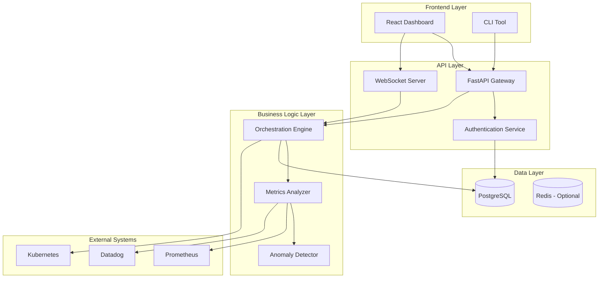
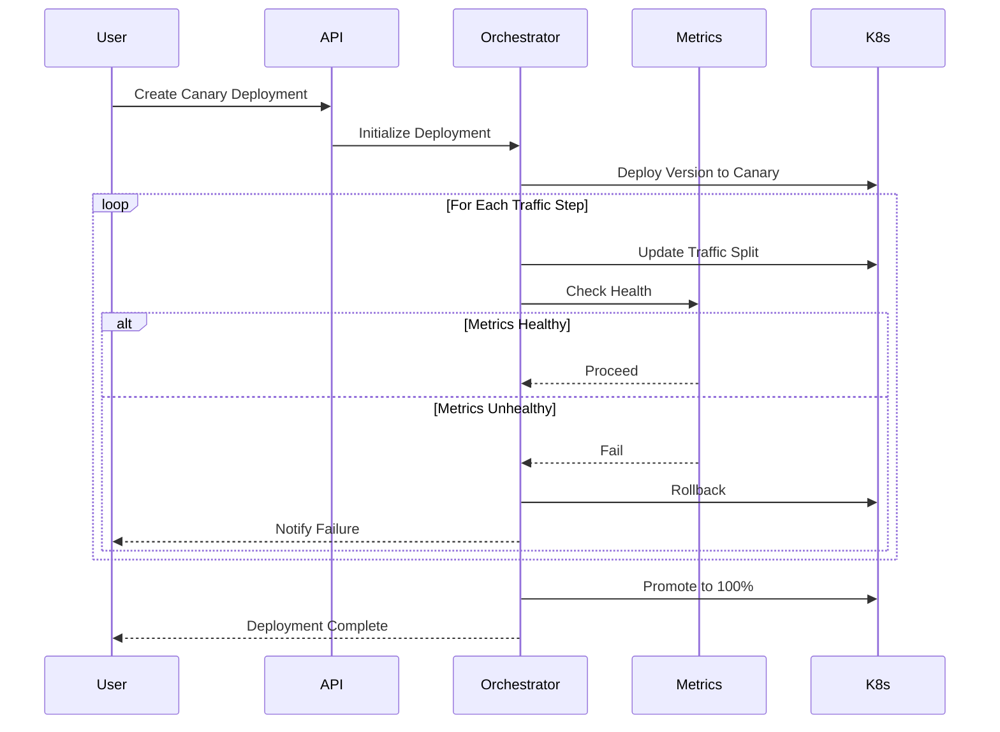
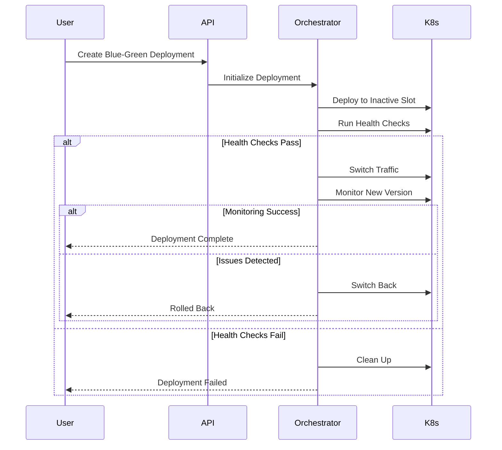
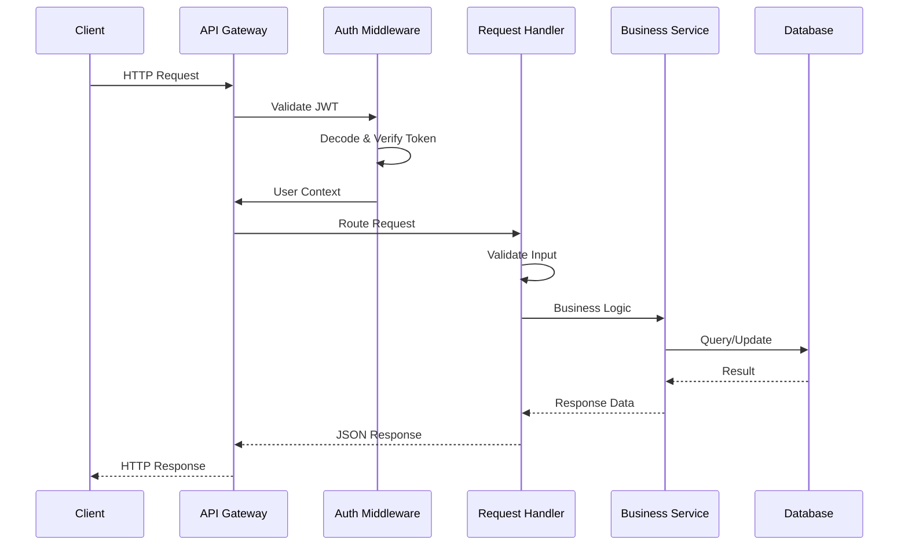
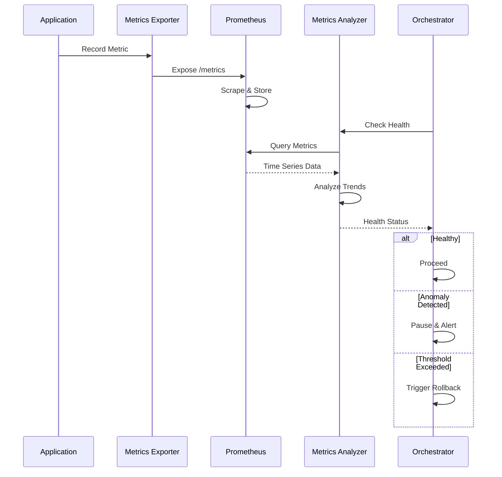
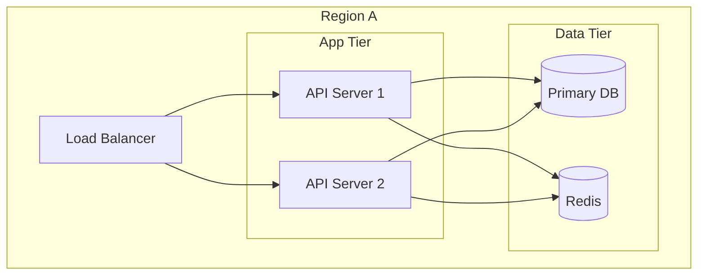
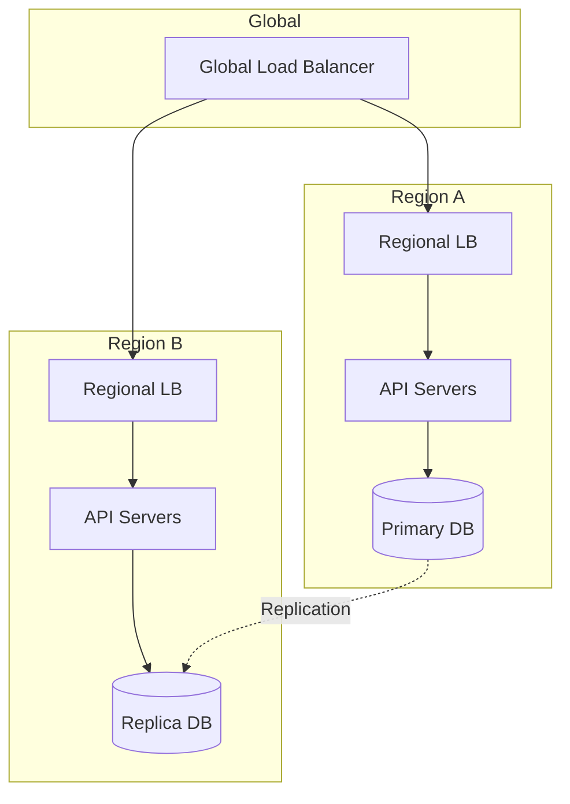

# Architecture Guide

## System Overview

The Adaptive Deployment Orchestrator is a production-grade platform for managing Blue-Green and Canary deployments with intelligent, metrics-driven decision making. The system follows a microservices architecture with clear separation of concerns.

## High-Level Architecture



## Component Architecture

### 1. Frontend Layer

#### React Dashboard
- **Technology**: React 18 + TypeScript + Vite
- **State Management**: Zustand for global state, React Query for server state
- **Real-time Updates**: WebSocket connection for live deployment updates
- **Features**:
  - Deployment list view with filtering
  - Detailed deployment monitoring with real-time progress
  - Interactive controls (pause, resume, rollback, promote)
  - Metric visualization
  - Event log streaming

#### CLI Tool
- **Technology**: Python + Click + Rich
- **Purpose**: Automation and CI/CD integration
- **Features**:
  - Deployment creation and management
  - Status monitoring
  - Control operations
  - Pipeline integration

### 2. API Layer

#### FastAPI Gateway
- **Features**:
  - RESTful API endpoints
  - Automatic OpenAPI/Swagger documentation
  - Request validation with Pydantic
  - CORS middleware
  - Rate limiting
  - Structured logging

#### WebSocket Server
- **Purpose**: Real-time bidirectional communication
- **Features**:
  - Connection management with heartbeat
  - Event broadcasting
  - Per-deployment subscriptions
  - Automatic reconnection

#### Authentication Service
- **Method**: JWT-based authentication
- **Features**:
  - Token generation and validation
  - Role-Based Access Control (RBAC)
  - Audit logging
  - Password hashing with bcrypt

### 3. Business Logic Layer

#### Orchestration Engine

The core of the system, responsible for managing deployment lifecycle.

**Key Components**:

1. **State Machine**
   ```
   PENDING → IN_PROGRESS → COMPLETED
        ↓         ↓            ↑
        ↓      PAUSED ←--------+
        ↓         ↓
        +→ ROLLED_BACK
        ↓
        +→ FAILED
   ```

2. **Deployment Strategies**:

   **Canary Deployment**:
   - Progressive traffic shifting (e.g., 10% → 25% → 50% → 100%)
   - Health checks at each step
   - Automated rollback on failure
   - Configurable steps and thresholds

   **Blue-Green Deployment**:
   - Deploy to inactive slot
   - Health validation
   - Instant traffic switch
   - Quick rollback capability

3. **Control Operations**:
   - **Start**: Begin deployment execution
   - **Pause**: Halt at current step
   - **Resume**: Continue from paused state
   - **Rollback**: Revert to previous version
   - **Promote**: Skip to 100% immediately

#### Metrics Analyzer

Intelligent metrics evaluation system with anomaly detection.

**Features**:
- Real-time metric collection from Prometheus/Datadog
- Threshold-based health checks
- Statistical anomaly detection (Z-score method)
- Trend analysis
- Configurable metric windows

**Supported Metrics**:
- Error rate
- Latency (P95, P99)
- Success rate
- Custom metrics

**Decision Logic**:
```python
if error_rate > threshold:
    trigger_rollback()
elif anomaly_detected():
    pause_deployment()
    notify_operator()
elif metrics_healthy():
    proceed_to_next_step()
```

#### Anomaly Detector

Statistical analysis for identifying unusual patterns.

**Algorithm**: Z-Score with sliding window
- Window size: Configurable (default 50 samples)
- Threshold: Configurable standard deviations (default 2.5)
- Features: Trend detection, outlier identification

### 4. Data Layer

#### PostgreSQL Database

**Schema Design**:

1. **deployments**: Main deployment records
2. **deployment_history**: State change audit trail
3. **deployment_events**: Event log
4. **deployment_metrics**: Time-series metric data
5. **users**: User accounts
6. **audit_logs**: Security audit trail

**Indexes**:
- Composite indexes on frequently queried columns
- Time-based indexes for efficient range queries
- Unique constraints on business keys

**Features**:
- Connection pooling (20 connections, 40 max overflow)
- Async operations with asyncpg
- Automatic retry with backoff
- Health checks

### 5. External Integrations

#### Prometheus
- Metric scraping
- Custom metric queries
- Alerting integration

#### Kubernetes
- Deployment management
- Traffic routing (via Ingress/Service Mesh)
- Health checks
- Rollback operations

#### Datadog (Optional)
- APM integration
- Custom metrics
- Log aggregation

## Deployment Flow

### Canary Deployment Flow



### Blue-Green Deployment Flow



## Security Architecture

### Authentication & Authorization

1. **JWT Tokens**:
   - Short-lived access tokens (default 1 hour)
   - Signed with HS256 algorithm
   - Includes user ID and role claims

2. **Role-Based Access Control**:
   - **Admin**: Full system access
   - **Operator**: Deployment management
   - **Viewer**: Read-only access

3. **API Security**:
   - HTTPS enforcement in production
   - CORS configuration
   - Rate limiting
   - Input validation and sanitization

### Audit Logging

All critical operations are logged with:
- User identification
- Action performed
- Timestamp
- Request/response data
- Success/failure status

## Observability

### Structured Logging

JSON-formatted logs with:
- Correlation IDs
- Severity levels
- Contextual metadata
- Error stack traces

### Metrics

Prometheus-compatible metrics:
- HTTP request latency and count
- Deployment operation counters
- WebSocket connection count
- Database connection pool stats

### Distributed Tracing (Optional)

OpenTelemetry integration for:
- Request tracing across services
- Performance bottleneck identification
- Dependency mapping

## Scalability Considerations

### Horizontal Scaling

- **API Layer**: Stateless, can scale horizontally behind load balancer
- **WebSocket**: Requires sticky sessions or Redis pub/sub for multi-instance
- **Database**: Connection pooling, read replicas for scaling reads

### Performance Optimizations

1. **Database**:
   - Indexed queries
   - Connection pooling
   - Query optimization

2. **API**:
   - Response caching
   - Async operations
   - Pagination for list endpoints

3. **WebSocket**:
   - Message queuing
   - Heartbeat for connection management
   - Efficient broadcasting

## Reliability & Resilience

### Error Handling

- Graceful degradation
- Retry with exponential backoff
- Circuit breaker pattern for external services
- Comprehensive error logging

### High Availability

- Health check endpoints
- Readiness probes
- Graceful shutdown
- Database connection retry

### Disaster Recovery

- Regular database backups
- State persistence
- Audit trail for reconstruction
- Rollback capabilities

## Data Flow Diagrams

### Request Processing Flow



### Metrics Collection Flow



## Technology Stack Summary

| Layer | Technology | Purpose |
|-------|-----------|---------|
| Frontend | React 18 + TypeScript | Interactive UI |
| API | FastAPI + Uvicorn | High-performance API |
| Database | PostgreSQL | Persistent storage |
| Metrics | Prometheus | Time-series metrics |
| Container | Docker + Docker Compose | Containerization |
| Orchestration | Kubernetes (optional) | Container orchestration |
| Monitoring | Grafana | Visualization |
| Language | Python 3.11 | Backend logic |
| Language | TypeScript | Frontend logic |

## Production Deployment Patterns

### Single Region Deployment



### Multi-Region Deployment



## See Also

- [API Reference](./API.md)
- [Deployment Guide](./DEPLOYMENT.md)
- [Security Best Practices](./SECURITY.md)
- [CLI Reference](./CLI.md)
