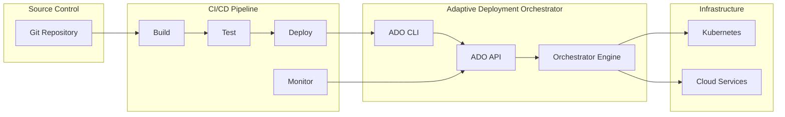
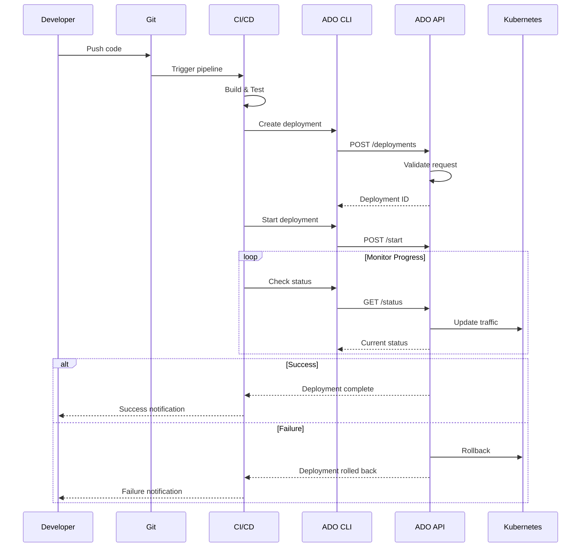
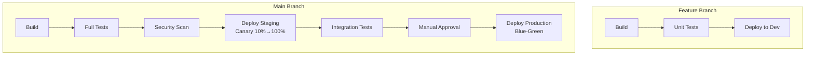
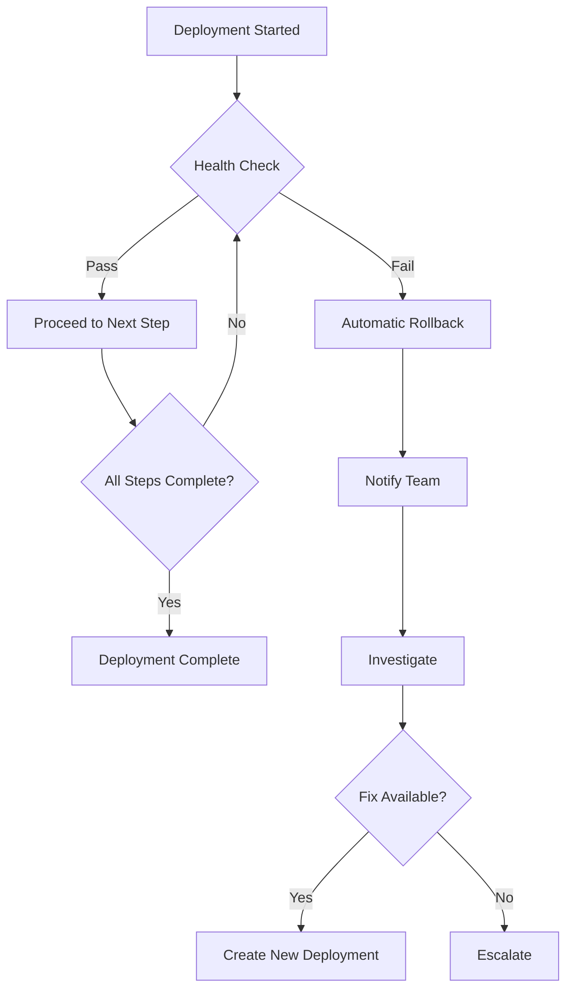

# CI/CD Integration Guide

Comprehensive guide for integrating the Adaptive Deployment Orchestrator with CI/CD pipelines.

## Overview

The Adaptive Deployment Orchestrator integrates seamlessly with popular CI/CD platforms to enable automated, intelligent deployments.



---

## CI/CD Pipeline Architecture

### Deployment Flow



---

## GitHub Actions

### Complete Workflow

```yaml
# .github/workflows/deploy.yml
name: Deploy with Canary Strategy

on:
  push:
    branches: [main]
  workflow_dispatch:
    inputs:
      service_name:
        description: 'Service name to deploy'
        required: true
        default: 'news-api'
      version:
        description: 'Version to deploy'
        required: true
      environment:
        description: 'Target environment'
        required: true
        default: 'staging'
        type: choice
        options:
          - development
          - staging
          - production
      strategy:
        description: 'Deployment strategy'
        required: true
        default: 'canary'
        type: choice
        options:
          - canary
          - blue_green

env:
  ADO_API_URL: ${{ secrets.ADO_API_URL }}

jobs:
  build:
    runs-on: ubuntu-latest
    outputs:
      version: ${{ steps.version.outputs.version }}
    steps:
      - uses: actions/checkout@v4
      
      - name: Set version
        id: version
        run: |
          VERSION=${{ github.event.inputs.version || github.sha }}
          echo "version=${VERSION:0:7}" >> $GITHUB_OUTPUT
      
      - name: Build application
        run: |
          # Your build commands here
          echo "Building version ${{ steps.version.outputs.version }}"

  test:
    runs-on: ubuntu-latest
    needs: build
    steps:
      - uses: actions/checkout@v4
      
      - name: Run tests
        run: |
          # Your test commands here
          echo "Running tests"

  deploy:
    runs-on: ubuntu-latest
    needs: [build, test]
    environment: ${{ github.event.inputs.environment || 'staging' }}
    
    steps:
      - uses: actions/checkout@v4
      
      - name: Set up Python
        uses: actions/setup-python@v4
        with:
          python-version: '3.11'
      
      - name: Install ADO CLI
        run: |
          cd cli
          pip install -e .
      
      - name: Login to ADO
        run: |
          adaptive-deploy login \
            --username ${{ secrets.ADO_USERNAME }} \
            --password ${{ secrets.ADO_PASSWORD }}
      
      - name: Create deployment
        id: create
        run: |
          STRATEGY=${{ github.event.inputs.strategy || 'canary' }}
          VERSION=${{ needs.build.outputs.version }}
          SERVICE=${{ github.event.inputs.service_name || 'news-api' }}
          ENV=${{ github.event.inputs.environment || 'staging' }}
          
          if [ "$STRATEGY" = "canary" ]; then
            OUTPUT=$(adaptive-deploy canary deploy \
              --service $SERVICE \
              --version $VERSION \
              --environment $ENV \
              --steps 10,25,50,100 \
              --metric error_rate:0.05 \
              --metric latency_p99:1000 \
              --auto-start)
          else
            OUTPUT=$(adaptive-deploy blue-green deploy \
              --service $SERVICE \
              --version $VERSION \
              --environment $ENV \
              --auto-start)
          fi
          
          DEPLOYMENT_ID=$(echo "$OUTPUT" | grep -oP 'Deployment created: \K[^ ]+' || echo "$OUTPUT")
          echo "deployment_id=$DEPLOYMENT_ID" >> $GITHUB_OUTPUT
          echo "Deployment ID: $DEPLOYMENT_ID"
      
      - name: Monitor deployment
        timeout-minutes: 30
        run: |
          DEPLOYMENT_ID="${{ steps.create.outputs.deployment_id }}"
          echo "Monitoring deployment: $DEPLOYMENT_ID"
          
          MAX_ATTEMPTS=60
          ATTEMPT=0
          
          while [ $ATTEMPT -lt $MAX_ATTEMPTS ]; do
            ATTEMPT=$((ATTEMPT + 1))
            
            STATUS=$(adaptive-deploy status --deployment $DEPLOYMENT_ID 2>/dev/null | grep -oP 'Status: \K[^ ]+' || echo "checking")
            TRAFFIC=$(adaptive-deploy status --deployment $DEPLOYMENT_ID 2>/dev/null | grep -oP 'Traffic: \K[^ ]+' || echo "0%")
            
            echo "[$ATTEMPT/$MAX_ATTEMPTS] Status: $STATUS | Traffic: $TRAFFIC"
            
            case $STATUS in
              completed)
                echo "✅ Deployment completed successfully!"
                exit 0
                ;;
              failed|rolled_back)
                echo "❌ Deployment failed or was rolled back"
                exit 1
                ;;
            esac
            
            sleep 30
          done
          
          echo "⏱️ Deployment monitoring timed out"
          exit 1
      
      - name: Rollback on failure
        if: failure()
        run: |
          DEPLOYMENT_ID="${{ steps.create.outputs.deployment_id }}"
          if [ -n "$DEPLOYMENT_ID" ]; then
            adaptive-deploy rollback \
              --deployment $DEPLOYMENT_ID \
              --reason "CI/CD pipeline failure - automated rollback"
          fi

  notify:
    runs-on: ubuntu-latest
    needs: [build, deploy]
    if: always()
    steps:
      - name: Send Slack notification
        uses: slackapi/slack-github-action@v1
        with:
          webhook-url: ${{ secrets.SLACK_WEBHOOK_URL }}
          payload: |
            {
              "text": "Deployment ${{ needs.deploy.result }}: ${{ github.event.inputs.service_name || 'news-api' }}",
              "attachments": [{
                "color": "${{ needs.deploy.result == 'success' && 'good' || 'danger' }}",
                "fields": [
                  {"title": "Service", "value": "${{ github.event.inputs.service_name || 'news-api' }}", "short": true},
                  {"title": "Version", "value": "${{ needs.build.outputs.version }}", "short": true},
                  {"title": "Environment", "value": "${{ github.event.inputs.environment || 'staging' }}", "short": true},
                  {"title": "Status", "value": "${{ needs.deploy.result }}", "short": true}
                ]
              }]
            }
```

### Reusable Workflow

```yaml
# .github/workflows/reusable-deploy.yml
name: Reusable Deployment Workflow

on:
  workflow_call:
    inputs:
      service_name:
        required: true
        type: string
      version:
        required: true
        type: string
      environment:
        required: true
        type: string
      strategy:
        required: false
        type: string
        default: 'canary'
    secrets:
      ADO_API_URL:
        required: true
      ADO_USERNAME:
        required: true
      ADO_PASSWORD:
        required: true

jobs:
  deploy:
    runs-on: ubuntu-latest
    steps:
      - uses: actions/checkout@v4
      
      - name: Deploy
        run: |
          pip install adaptive-deploy
          adaptive-deploy login --username ${{ secrets.ADO_USERNAME }} --password ${{ secrets.ADO_PASSWORD }}
          adaptive-deploy ${{ inputs.strategy }} deploy \
            --service ${{ inputs.service_name }} \
            --version ${{ inputs.version }} \
            --environment ${{ inputs.environment }} \
            --auto-start
```

### Using the Reusable Workflow

```yaml
# .github/workflows/deploy-service.yml
name: Deploy Service

on:
  push:
    branches: [main]

jobs:
  deploy:
    uses: ./.github/workflows/reusable-deploy.yml
    with:
      service_name: news-api
      version: ${{ github.sha }}
      environment: staging
    secrets: inherit
```

---

## GitLab CI/CD

### Complete Pipeline

```yaml
# .gitlab-ci.yml
stages:
  - build
  - test
  - security
  - deploy
  - monitor

variables:
  ADO_API_URL: "${ADO_API_URL}"
  SERVICE_NAME: "news-api"
  DOCKER_DRIVER: overlay2

# Templates
.deploy_template: &deploy_template
  image: python:3.11-slim
  before_script:
    - cd cli && pip install -e .
    - adaptive-deploy login --username ${ADO_USERNAME} --password ${ADO_PASSWORD}

# Build Stage
build:backend:
  stage: build
  image: python:3.11-slim
  script:
    - cd backend
    - pip install -r requirements.txt
    - python -m compileall app
  artifacts:
    paths:
      - backend/
    expire_in: 1 hour

build:frontend:
  stage: build
  image: node:18-alpine
  script:
    - cd frontend
    - npm ci
    - npm run build
  artifacts:
    paths:
      - frontend/dist/
    expire_in: 1 hour

build:docker:
  stage: build
  image: docker:24
  services:
    - docker:dind
  script:
    - docker build -t ${CI_REGISTRY_IMAGE}/backend:${CI_COMMIT_SHORT_SHA} backend/
    - docker build -t ${CI_REGISTRY_IMAGE}/frontend:${CI_COMMIT_SHORT_SHA} frontend/
    - docker login -u ${CI_REGISTRY_USER} -p ${CI_REGISTRY_PASSWORD} ${CI_REGISTRY}
    - docker push ${CI_REGISTRY_IMAGE}/backend:${CI_COMMIT_SHORT_SHA}
    - docker push ${CI_REGISTRY_IMAGE}/frontend:${CI_COMMIT_SHORT_SHA}
  only:
    - main
    - develop

# Test Stage
test:backend:
  stage: test
  image: python:3.11-slim
  dependencies:
    - build:backend
  script:
    - cd backend
    - pip install -r requirements.txt pytest pytest-asyncio pytest-cov
    - pytest tests/ --cov=app --cov-report=xml --cov-report=term
  coverage: '/(?i)total.*? (100(?:\.0+)?\%|[1-9]?\d(?:\.\d+)?\%)$/'
  artifacts:
    reports:
      coverage_report:
        coverage_format: cobertura
        path: backend/coverage.xml

test:frontend:
  stage: test
  image: node:18-alpine
  dependencies:
    - build:frontend
  script:
    - cd frontend
    - npm ci
    - npm run type-check
    - npm run lint
    - npm test -- --coverage
  artifacts:
    reports:
      coverage_report:
        coverage_format: cobertura
        path: frontend/coverage/cobertura-coverage.xml

# Security Stage
security:scan:
  stage: security
  image: python:3.11-slim
  script:
    - pip install safety bandit
    - safety check -r backend/requirements.txt
    - bandit -r backend/app -ll
  allow_failure: true

security:container:
  stage: security
  image: aquasec/trivy:latest
  script:
    - trivy image --severity HIGH,CRITICAL ${CI_REGISTRY_IMAGE}/backend:${CI_COMMIT_SHORT_SHA}
  allow_failure: true
  only:
    - main

# Deploy to Development
deploy:development:
  <<: *deploy_template
  stage: deploy
  script:
    - |
      adaptive-deploy canary deploy \
        --service ${SERVICE_NAME} \
        --version ${CI_COMMIT_SHORT_SHA} \
        --environment development \
        --steps 50,100 \
        --auto-start
  environment:
    name: development
    url: https://dev.example.com
  only:
    - develop

# Deploy to Staging (Canary)
deploy:staging:
  <<: *deploy_template
  stage: deploy
  script:
    - |
      OUTPUT=$(adaptive-deploy canary deploy \
        --service ${SERVICE_NAME} \
        --version ${CI_COMMIT_SHORT_SHA} \
        --environment staging \
        --steps 10,25,50,100 \
        --metric error_rate:0.05 \
        --metric latency_p99:1000 \
        --auto-start)
      
      DEPLOYMENT_ID=$(echo "$OUTPUT" | grep -oP 'Deployment created: \K[^ ]+')
      echo "DEPLOYMENT_ID=$DEPLOYMENT_ID" > deployment.env
      echo "Deployment ID: $DEPLOYMENT_ID"
  environment:
    name: staging
    url: https://staging.example.com
  artifacts:
    reports:
      dotenv: deployment.env
  only:
    - main

# Deploy to Production (Blue-Green)
deploy:production:
  <<: *deploy_template
  stage: deploy
  script:
    - |
      OUTPUT=$(adaptive-deploy blue-green deploy \
        --service ${SERVICE_NAME} \
        --version ${CI_COMMIT_SHORT_SHA} \
        --environment production)
      
      DEPLOYMENT_ID=$(echo "$OUTPUT" | grep -oP 'Deployment created: \K[^ ]+')
      echo "DEPLOYMENT_ID=$DEPLOYMENT_ID" > deployment.env
      
      # Start deployment
      adaptive-deploy start --deployment $DEPLOYMENT_ID
  environment:
    name: production
    url: https://example.com
  artifacts:
    reports:
      dotenv: deployment.env
  when: manual
  only:
    - main

# Monitor Deployment
monitor:staging:
  <<: *deploy_template
  stage: monitor
  dependencies:
    - deploy:staging
  script:
    - |
      echo "Monitoring deployment: ${DEPLOYMENT_ID}"
      
      for i in {1..40}; do
        STATUS=$(adaptive-deploy status --deployment ${DEPLOYMENT_ID} | grep -oP 'Status: \K[^ ]+')
        TRAFFIC=$(adaptive-deploy status --deployment ${DEPLOYMENT_ID} | grep -oP 'Traffic: \K[^ ]+' || echo "0%")
        
        echo "[$i/40] Status: $STATUS | Traffic: $TRAFFIC"
        
        if [ "$STATUS" == "completed" ]; then
          echo "✅ Deployment completed successfully"
          exit 0
        elif [ "$STATUS" == "failed" ] || [ "$STATUS" == "rolled_back" ]; then
          echo "❌ Deployment failed or rolled back"
          exit 1
        fi
        
        sleep 30
      done
      
      echo "⏱️ Deployment monitoring timeout"
      exit 1
  retry:
    max: 2
    when:
      - runner_system_failure
      - stuck_or_timeout_failure
  needs:
    - deploy:staging

# Rollback Job
rollback:
  <<: *deploy_template
  stage: deploy
  script:
    - |
      adaptive-deploy rollback \
        --deployment ${DEPLOYMENT_ID} \
        --reason "Manual rollback from GitLab CI"
  when: manual
  environment:
    name: production
    action: stop
```

---

## Jenkins

### Declarative Pipeline

```groovy
// Jenkinsfile
pipeline {
    agent any
    
    environment {
        ADO_API_URL = credentials('ado-api-url')
        ADO_USERNAME = credentials('ado-username')
        ADO_PASSWORD = credentials('ado-password')
    }
    
    parameters {
        string(name: 'SERVICE_NAME', defaultValue: 'news-api', description: 'Service to deploy')
        string(name: 'VERSION', defaultValue: '', description: 'Version to deploy (leave empty for commit SHA)')
        choice(name: 'ENVIRONMENT', choices: ['development', 'staging', 'production'], description: 'Target environment')
        choice(name: 'STRATEGY', choices: ['canary', 'blue_green'], description: 'Deployment strategy')
    }
    
    stages {
        stage('Setup') {
            steps {
                script {
                    env.DEPLOY_VERSION = params.VERSION ?: env.GIT_COMMIT.take(7)
                }
                sh '''
                    pip install adaptive-deploy
                    adaptive-deploy login --username ${ADO_USERNAME} --password ${ADO_PASSWORD}
                '''
            }
        }
        
        stage('Build') {
            steps {
                sh 'echo "Building version ${DEPLOY_VERSION}"'
                // Your build steps here
            }
        }
        
        stage('Test') {
            steps {
                sh 'echo "Running tests"'
                // Your test steps here
            }
        }
        
        stage('Deploy') {
            steps {
                script {
                    def deployCmd = ""
                    
                    if (params.STRATEGY == 'canary') {
                        deployCmd = """
                            adaptive-deploy canary deploy \
                                --service ${params.SERVICE_NAME} \
                                --version ${env.DEPLOY_VERSION} \
                                --environment ${params.ENVIRONMENT} \
                                --steps 10,25,50,100 \
                                --metric error_rate:0.05 \
                                --auto-start
                        """
                    } else {
                        deployCmd = """
                            adaptive-deploy blue-green deploy \
                                --service ${params.SERVICE_NAME} \
                                --version ${env.DEPLOY_VERSION} \
                                --environment ${params.ENVIRONMENT} \
                                --auto-start
                        """
                    }
                    
                    def output = sh(script: deployCmd, returnStdout: true).trim()
                    def deploymentId = (output =~ /Deployment created: (\S+)/)[0][1]
                    env.DEPLOYMENT_ID = deploymentId
                    
                    echo "Created deployment: ${deploymentId}"
                }
            }
        }
        
        stage('Monitor') {
            steps {
                timeout(time: 30, unit: 'MINUTES') {
                    script {
                        def completed = false
                        def attempts = 0
                        def maxAttempts = 60
                        
                        while (!completed && attempts < maxAttempts) {
                            attempts++
                            
                            def statusOutput = sh(
                                script: "adaptive-deploy status --deployment ${env.DEPLOYMENT_ID}",
                                returnStdout: true
                            ).trim()
                            
                            def status = (statusOutput =~ /Status: (\S+)/)[0][1]
                            
                            echo "[${attempts}/${maxAttempts}] Status: ${status}"
                            
                            switch(status) {
                                case 'completed':
                                    completed = true
                                    echo "✅ Deployment completed successfully!"
                                    break
                                case 'failed':
                                case 'rolled_back':
                                    error("❌ Deployment failed or was rolled back")
                                    break
                                default:
                                    sleep(30)
                            }
                        }
                        
                        if (!completed) {
                            error("⏱️ Deployment monitoring timed out")
                        }
                    }
                }
            }
        }
    }
    
    post {
        failure {
            sh '''
                if [ -n "${DEPLOYMENT_ID}" ]; then
                    adaptive-deploy rollback \
                        --deployment ${DEPLOYMENT_ID} \
                        --reason "Jenkins pipeline failure - automated rollback"
                fi
            '''
        }
        always {
            slackSend(
                channel: '#deployments',
                color: currentBuild.result == 'SUCCESS' ? 'good' : 'danger',
                message: "Deployment ${currentBuild.result}: ${params.SERVICE_NAME} v${env.DEPLOY_VERSION} to ${params.ENVIRONMENT}"
            )
        }
    }
}
```

---

## Azure DevOps

### YAML Pipeline

```yaml
# azure-pipelines.yml
trigger:
  branches:
    include:
      - main
      - develop

parameters:
  - name: serviceName
    displayName: 'Service Name'
    type: string
    default: 'news-api'
  - name: environment
    displayName: 'Target Environment'
    type: string
    default: 'staging'
    values:
      - development
      - staging
      - production
  - name: strategy
    displayName: 'Deployment Strategy'
    type: string
    default: 'canary'
    values:
      - canary
      - blue_green

variables:
  - group: ado-credentials
  - name: version
    value: $(Build.BuildNumber)

stages:
  - stage: Build
    jobs:
      - job: BuildJob
        pool:
          vmImage: 'ubuntu-latest'
        steps:
          - task: UsePythonVersion@0
            inputs:
              versionSpec: '3.11'
          
          - script: |
              echo "Building version $(version)"
              # Your build commands here
            displayName: 'Build Application'

  - stage: Test
    dependsOn: Build
    jobs:
      - job: TestJob
        pool:
          vmImage: 'ubuntu-latest'
        steps:
          - script: |
              echo "Running tests"
              # Your test commands here
            displayName: 'Run Tests'

  - stage: Deploy
    dependsOn: Test
    jobs:
      - deployment: DeployJob
        pool:
          vmImage: 'ubuntu-latest'
        environment: ${{ parameters.environment }}
        strategy:
          runOnce:
            deploy:
              steps:
                - task: UsePythonVersion@0
                  inputs:
                    versionSpec: '3.11'
                
                - script: |
                    pip install adaptive-deploy
                    adaptive-deploy login --username $(ADO_USERNAME) --password $(ADO_PASSWORD)
                  displayName: 'Setup ADO CLI'
                
                - script: |
                    if [ "${{ parameters.strategy }}" = "canary" ]; then
                      adaptive-deploy canary deploy \
                        --service ${{ parameters.serviceName }} \
                        --version $(version) \
                        --environment ${{ parameters.environment }} \
                        --steps 10,25,50,100 \
                        --metric error_rate:0.05 \
                        --auto-start
                    else
                      adaptive-deploy blue-green deploy \
                        --service ${{ parameters.serviceName }} \
                        --version $(version) \
                        --environment ${{ parameters.environment }} \
                        --auto-start
                    fi
                  displayName: 'Create Deployment'
                  env:
                    ADO_API_URL: $(ADO_API_URL)
```

---

## CircleCI

### Configuration

```yaml
# .circleci/config.yml
version: 2.1

orbs:
  slack: circleci/slack@4.10.1

executors:
  python:
    docker:
      - image: python:3.11-slim

commands:
  setup-ado:
    steps:
      - run:
          name: Install ADO CLI
          command: pip install adaptive-deploy
      - run:
          name: Login to ADO
          command: |
            adaptive-deploy login \
              --username ${ADO_USERNAME} \
              --password ${ADO_PASSWORD}

jobs:
  build:
    executor: python
    steps:
      - checkout
      - run:
          name: Build
          command: echo "Building..."

  test:
    executor: python
    steps:
      - checkout
      - run:
          name: Test
          command: echo "Testing..."

  deploy:
    executor: python
    parameters:
      environment:
        type: string
        default: staging
      strategy:
        type: string
        default: canary
    steps:
      - checkout
      - setup-ado
      - run:
          name: Create Deployment
          command: |
            if [ "<< parameters.strategy >>" = "canary" ]; then
              adaptive-deploy canary deploy \
                --service ${SERVICE_NAME:-news-api} \
                --version ${CIRCLE_SHA1:0:7} \
                --environment << parameters.environment >> \
                --steps 10,25,50,100 \
                --metric error_rate:0.05 \
                --auto-start
            else
              adaptive-deploy blue-green deploy \
                --service ${SERVICE_NAME:-news-api} \
                --version ${CIRCLE_SHA1:0:7} \
                --environment << parameters.environment >> \
                --auto-start
            fi

  monitor:
    executor: python
    steps:
      - setup-ado
      - run:
          name: Monitor Deployment
          command: |
            for i in {1..40}; do
              STATUS=$(adaptive-deploy status --deployment ${DEPLOYMENT_ID} | grep -oP 'Status: \K[^ ]+')
              echo "[$i/40] Status: $STATUS"
              
              case $STATUS in
                completed) exit 0 ;;
                failed|rolled_back) exit 1 ;;
              esac
              
              sleep 30
            done
            exit 1

workflows:
  deploy-workflow:
    jobs:
      - build
      - test:
          requires:
            - build
      - deploy:
          requires:
            - test
          environment: staging
          strategy: canary
          filters:
            branches:
              only: main
      - hold-production:
          type: approval
          requires:
            - deploy
      - deploy:
          name: deploy-production
          requires:
            - hold-production
          environment: production
          strategy: blue_green
```

---

## Best Practices

### Pipeline Design Patterns



### Environment Strategy

| Environment | Strategy | Auto-Start | Steps | Approval |
|-------------|----------|------------|-------|----------|
| Development | Canary | Yes | 50,100 | No |
| Staging | Canary | Yes | 10,25,50,100 | No |
| Production | Blue-Green | No | N/A | Yes |

### Metrics Configuration

```yaml
# Recommended metrics thresholds by environment
development:
  error_rate: 0.10
  latency_p99: 2000

staging:
  error_rate: 0.05
  latency_p99: 1000

production:
  error_rate: 0.02
  latency_p99: 500
```

### Rollback Strategy



---

## Troubleshooting

### Common Issues

| Issue | Cause | Solution |
|-------|-------|----------|
| Authentication failed | Invalid credentials | Verify ADO_USERNAME and ADO_PASSWORD |
| Deployment not found | Wrong deployment ID | Check deployment creation output |
| Rollback failed | Already rolled back | Check current deployment status |
| Timeout during monitoring | Slow metrics | Increase monitoring timeout |

### Debug Mode

```bash
# Enable debug output
export ADO_DEBUG=true
adaptive-deploy canary deploy --service news-api --version v1.0.0 --environment staging
```

### Health Check Script

```bash
#!/bin/bash
# health-check.sh

# Check API connectivity
echo "Checking API connectivity..."
curl -f ${ADO_API_URL}/health || exit 1

# Check authentication
echo "Checking authentication..."
adaptive-deploy health || exit 1

echo "All checks passed!"
```

---

## See Also

- [CLI Reference](./CLI.md)
- [API Reference](./API.md)
- [Deployment Guide](./DEPLOYMENT.md)
- [Security Best Practices](./SECURITY.md)
