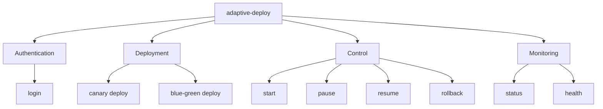

# CLI Reference Guide

Complete reference for the Adaptive Deploy CLI tool.

## Overview

The CLI provides command-line access to all deployment operations, designed for both interactive use and CI/CD automation.

```mermaid
graph LR
    subgraph "CLI Commands"
        Login[login]
        Canary[canary deploy]
        BlueGreen[blue-green deploy]
        Control[start/pause/resume]
        Status[status]
        Rollback[rollback]
    end

    subgraph "API"
        API[ADO API]
    end

    Login --> API
    Canary --> API
    BlueGreen --> API
    Control --> API
    Status --> API
    Rollback --> API
```

## Installation

```bash
# From source
cd cli
pip install -e .

# Verify installation
adaptive-deploy --version
```

## Configuration

### Environment Variables

```bash
# API endpoint
export ADO_API_URL=http://localhost:8000

# Authentication token (obtained from login)
export ADO_TOKEN=your-jwt-token-here
```

### Configuration File (Optional)

Create `~/.ado/config.yaml`:

```yaml
api_url: http://localhost:8000
default_environment: staging
default_namespace: default
```

## Command Structure



## Global Options

Available for all commands:

```bash
--api-url TEXT     # API server URL (default: http://localhost:8000)
--token TEXT       # Authentication token
--help            # Show help message
```

## Authentication

### login

Login and obtain authentication token.

```bash
adaptive-deploy login [OPTIONS]
```

**Options:**
- `--username TEXT`: Username (prompted if not provided)
- `--password TEXT`: Password (prompted if not provided)

**Examples:**

```bash
# Interactive login
adaptive-deploy login

# Non-interactive login
adaptive-deploy login --username admin --password admin123

# Export token for later use
TOKEN=$(adaptive-deploy login --username admin --password admin123 | grep -oP 'Token: \K.*')
export ADO_TOKEN=$TOKEN
```

**Output:**
```
✓ Login successful!

Token: eyJhbGciOiJIUzI1NiIsInR5cCI6IkpXVCJ9...

Export this token:
export ADO_TOKEN=eyJhbGciOiJIUzI1NiIsInR5cCI6IkpXVCJ9...
```

## Canary Deployments

### canary deploy

Create and optionally start a canary deployment.

```bash
adaptive-deploy canary deploy [OPTIONS]
```

**Required Options:**
- `--service TEXT`: Service name
- `--version TEXT`: Target version to deploy

**Optional Parameters:**
- `--environment [development|staging|production]`: Target environment (default: staging)
- `--steps TEXT`: Comma-separated canary steps (default: 10,25,50,100)
- `--metric TEXT`: Metrics to monitor (format: name:threshold, can be used multiple times)
- `--namespace TEXT`: Kubernetes namespace (default: default)
- `--auto-start / --no-auto-start`: Start deployment automatically (default: false)

**Examples:**

```bash
# Basic canary deployment
adaptive-deploy canary deploy \
  --service news-api \
  --version v2.0.0

# Production deployment with custom steps and metrics
adaptive-deploy canary deploy \
  --service news-api \
  --version v2.0.0 \
  --environment production \
  --steps 5,10,25,50,75,100 \
  --metric error_rate:0.02 \
  --metric latency_p99:500 \
  --metric success_rate:0.99 \
  --auto-start

# CI/CD friendly (with auto-start)
adaptive-deploy canary deploy \
  --service $SERVICE_NAME \
  --version $CI_COMMIT_SHA \
  --environment staging \
  --auto-start
```

**Output:**
```
╭───────────────────────────────────────╮
│ Deployment Configuration              │
├───────────────────────────────────────┤
│ Canary Deployment                     │
│                                       │
│ Service: news-api                     │
│ Version: v2.0.0                       │
│ Environment: production               │
│ Steps: 10,25,50,100                   │
│ Metrics: 3                            │
╰───────────────────────────────────────╯

✓ Deployment created: news-api-canary-20240101120000

Start: adaptive-deploy start --deployment news-api-canary-20240101120000
```

## Blue-Green Deployments

### blue-green deploy

Create and optionally start a blue-green deployment.

```bash
adaptive-deploy blue-green deploy [OPTIONS]
```

**Required Options:**
- `--service TEXT`: Service name
- `--version TEXT`: Target version to deploy

**Optional Parameters:**
- `--environment [development|staging|production]`: Target environment (default: staging)
- `--namespace TEXT`: Kubernetes namespace (default: default)
- `--auto-start / --no-auto-start`: Start deployment automatically (default: false)

**Examples:**

```bash
# Basic blue-green deployment
adaptive-deploy blue-green deploy \
  --service news-api \
  --version v2.0.0 \
  --environment production

# With auto-start
adaptive-deploy blue-green deploy \
  --service auth-service \
  --version v1.5.2 \
  --environment production \
  --auto-start
```

**Output:**
```
╭───────────────────────────────────────╮
│ Deployment Configuration              │
├───────────────────────────────────────┤
│ Blue-Green Deployment                 │
│                                       │
│ Service: news-api                     │
│ Version: v2.0.0                       │
│ Environment: production               │
╰───────────────────────────────────────╯

✓ Deployment created: news-api-blue_green-20240101120000
```

## Deployment Control

### start

Start a pending deployment.

```bash
adaptive-deploy start --deployment DEPLOYMENT_ID
```

**Required Options:**
- `--deployment TEXT`: Deployment ID

**Examples:**

```bash
adaptive-deploy start --deployment news-api-canary-20240101120000
```

**Output:**
```
✓ Deployment started: in_progress
```

### pause

Pause a running deployment at the current step.

```bash
adaptive-deploy pause --deployment DEPLOYMENT_ID [--reason TEXT]
```

**Required Options:**
- `--deployment TEXT`: Deployment ID

**Optional Parameters:**
- `--reason TEXT`: Reason for pausing

**Examples:**

```bash
# Pause deployment
adaptive-deploy pause --deployment news-api-canary-20240101120000

# Pause with reason
adaptive-deploy pause \
  --deployment news-api-canary-20240101120000 \
  --reason "Investigating error spike"
```

**Output:**
```
✓ Deployment paused: paused
```

### resume

Resume a paused deployment.

```bash
adaptive-deploy resume --deployment DEPLOYMENT_ID
```

**Required Options:**
- `--deployment TEXT`: Deployment ID

**Examples:**

```bash
adaptive-deploy resume --deployment news-api-canary-20240101120000
```

**Output:**
```
✓ Deployment resumed: in_progress
```

### rollback

Rollback a deployment to the previous version.

```bash
adaptive-deploy rollback --deployment DEPLOYMENT_ID [--reason TEXT]
```

**Required Options:**
- `--deployment TEXT`: Deployment ID
- `--reason TEXT`: Reason for rollback (prompted if not provided)

**Examples:**

```bash
# Interactive rollback
adaptive-deploy rollback --deployment news-api-canary-20240101120000

# Non-interactive rollback
adaptive-deploy rollback \
  --deployment news-api-canary-20240101120000 \
  --reason "High error rate detected"
```

**Output:**
```
Are you sure you want to rollback news-api-canary-20240101120000? [y/N]: y
✓ Deployment rolled back: rolled_back
```

## Deployment Status

### status

Get status of deployments.

```bash
adaptive-deploy status [OPTIONS]
```

**Options:**
- `--deployment TEXT`: Specific deployment ID
- `--all`: Show all deployments
- `--service TEXT`: Filter by service name
- `--environment TEXT`: Filter by environment
- `--status TEXT`: Filter by status

**Examples:**

```bash
# Get specific deployment status
adaptive-deploy status --deployment news-api-canary-20240101120000

# List all deployments
adaptive-deploy status --all

# Filter by service
adaptive-deploy status --service news-api

# Filter by multiple criteria
adaptive-deploy status \
  --service news-api \
  --environment production \
  --status in_progress
```

**Output (Specific Deployment):**
```
╭──────────────────────────────────────────────────╮
│ Deployment Status                                │
├──────────────────────────────────────────────────┤
│ Deployment: news-api-canary-20240101120000       │
│ Service: news-api                                │
│ Status: in_progress                              │
│ Strategy: canary                                 │
│ Traffic: 25%                                     │
│ Version: v2.0.0                                  │
│ Environment: production                          │
╰──────────────────────────────────────────────────╯
```

**Output (List):**
```
                                  Deployments
┏━━━━━━━━━━━━━━━━━━━━━━┳━━━━━━━━━━┳━━━━━━━━━━━━━┳━━━━━━━━━━┳━━━━━━━━━┳━━━━━━━━━━━━━┓
┃ ID                   ┃ Service  ┃ Status      ┃ Strategy ┃ Traffic ┃ Environment ┃
┡━━━━━━━━━━━━━━━━━━━━━━╇━━━━━━━━━━╇━━━━━━━━━━━━━╇━━━━━━━━━━╇━━━━━━━━━╇━━━━━━━━━━━━━┩
│ news-api-canary-...  │ news-api │ in_progress │ canary   │ 25%     │ production  │
│ auth-service-blue... │ auth-svc │ completed   │ blue_... │ 100%    │ staging     │
└──────────────────────┴──────────┴─────────────┴──────────┴─────────┴─────────────┘

Total: 2 deployments
```

## Health Check

### health

Check API server health.

```bash
adaptive-deploy health
```

**Examples:**

```bash
adaptive-deploy health
```

**Output:**
```
╭──────────────────────────╮
│ API Health               │
├──────────────────────────┤
│ Healthy                  │
│                          │
│ Version: 1.0.0           │
│ Timestamp: 2024-01-01... │
╰──────────────────────────╯
```

## Exit Codes

| Code | Meaning |
|------|---------|
| 0    | Success |
| 1    | General error |
| 2    | Authentication error |
| 3    | Not found |
| 4    | Invalid input |
| 5    | API error |

## CI/CD Integration

### GitHub Actions

```yaml
- name: Deploy with Adaptive Deploy CLI
  run: |
    pip install adaptive-deploy
    adaptive-deploy login --username ${{ secrets.ADO_USERNAME }} --password ${{ secrets.ADO_PASSWORD }}
    adaptive-deploy canary deploy \
      --service ${{ github.event.repository.name }} \
      --version ${{ github.sha }} \
      --environment production \
      --auto-start
```

### GitLab CI

```yaml
deploy:
  script:
    - pip install adaptive-deploy
    - adaptive-deploy login --username ${ADO_USERNAME} --password ${ADO_PASSWORD}
    - |
      adaptive-deploy canary deploy \
        --service ${CI_PROJECT_NAME} \
        --version ${CI_COMMIT_SHORT_SHA} \
        --environment staging \
        --auto-start
```

### Jenkins

```groovy
stage('Deploy') {
    steps {
        sh '''
            pip install adaptive-deploy
            adaptive-deploy login --username ${ADO_USERNAME} --password ${ADO_PASSWORD}
            adaptive-deploy canary deploy \
                --service ${JOB_NAME} \
                --version ${GIT_COMMIT} \
                --environment production \
                --auto-start
        '''
    }
}
```

## Scripting Examples

### Deploy and Wait

```bash
#!/bin/bash
set -e

# Deploy
DEPLOYMENT_ID=$(adaptive-deploy canary deploy \
  --service news-api \
  --version v2.0.0 \
  --auto-start | grep -oP 'Deployment created: \K[^ ]+')

echo "Deployment ID: $DEPLOYMENT_ID"

# Monitor status
while true; do
  STATUS=$(adaptive-deploy status --deployment $DEPLOYMENT_ID | grep -oP 'Status: \K[^ ]+')
  echo "Current status: $STATUS"

  if [ "$STATUS" == "completed" ]; then
    echo "✓ Deployment successful"
    exit 0
  elif [ "$STATUS" == "failed" ] || [ "$STATUS" == "rolled_back" ]; then
    echo "✗ Deployment failed"
    exit 1
  fi

  sleep 30
done
```

### Batch Deployments

```bash
#!/bin/bash

SERVICES=("api" "web" "worker")
VERSION="v2.0.0"

for service in "${SERVICES[@]}"; do
  echo "Deploying $service..."
  adaptive-deploy canary deploy \
    --service $service \
    --version $VERSION \
    --environment staging \
    --auto-start
done
```

## Troubleshooting

### Authentication Issues

```bash
# Verify API is accessible
curl http://localhost:8000/health

# Check credentials
adaptive-deploy login --username admin --password admin123

# Verify token
echo $ADO_TOKEN
```

### Connection Errors

```bash
# Test API connectivity
curl -v http://localhost:8000/health

# Check API URL
echo $ADO_API_URL

# Try with explicit URL
adaptive-deploy --api-url http://localhost:8000 health
```

### Command Not Found

```bash
# Verify installation
pip list | grep adaptive-deploy

# Reinstall
pip install -e cli/

# Check PATH
echo $PATH
```

## Best Practices

1. **Use Environment Variables**: Store API URL and token in environment variables
2. **CI/CD Integration**: Use `--auto-start` for automated deployments
3. **Monitor Deployments**: Always check status after deployment
4. **Graceful Rollbacks**: Include `--reason` when rolling back
5. **Security**: Never commit tokens to version control
6. **Idempotency**: Safe to re-run commands if connection is lost
7. **Logging**: Capture CLI output for audit trails

## Advanced Usage

### Custom Metrics

```bash
adaptive-deploy canary deploy \
  --service api \
  --version v2.0.0 \
  --metric error_rate:0.05 \
  --metric latency_p99:1000 \
  --metric latency_p95:500 \
  --metric success_rate:0.99 \
  --metric custom_metric:100
```

### Progressive Rollout

```bash
# Very gradual rollout
adaptive-deploy canary deploy \
  --service critical-api \
  --version v2.0.0 \
  --steps 1,5,10,25,50,75,100 \
  --environment production
```

### Blue-Green with Manual Switch

```bash
# Create deployment (don't auto-start)
adaptive-deploy blue-green deploy \
  --service api \
  --version v2.0.0 \
  --environment production

# Manually verify, then start
adaptive-deploy start --deployment <deployment-id>
```

## See Also

- [API Reference](./API.md)
- [Deployment Guide](./DEPLOYMENT.md)
- [CI/CD Integration](./CICD.md)
