# Dashboard User Guide

Complete guide for using the Adaptive Deployment Orchestrator Dashboard.

## Overview

The Dashboard provides a real-time web interface for monitoring and controlling deployments. Built with React and TypeScript, it offers interactive controls, live updates via WebSocket, and comprehensive deployment visualization.

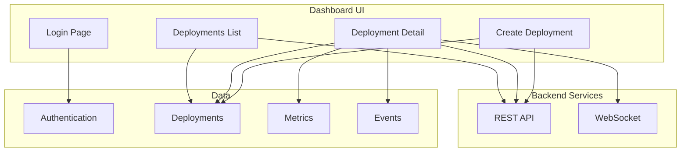

---

## Getting Started

### Access the Dashboard

| Environment | URL |
|-------------|-----|
| Local Development | http://localhost:3000 |
| Docker Compose | http://localhost:3000 |
| Production | https://dashboard.yourdomain.com |

### Login

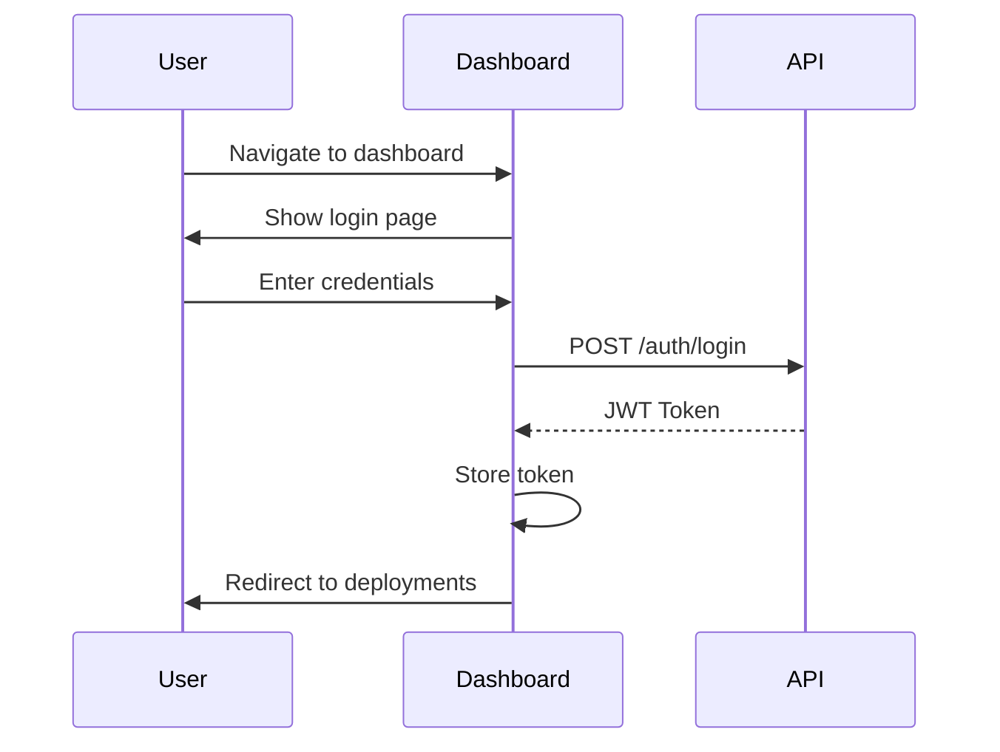

**Default Credentials:**

| Username | Password | Role |
|----------|----------|------|
| admin | *(set on first login)* | Admin |

> ⚠️ **Important:** Change the default password immediately after first login!

---

## Dashboard Layout

### Navigation Structure

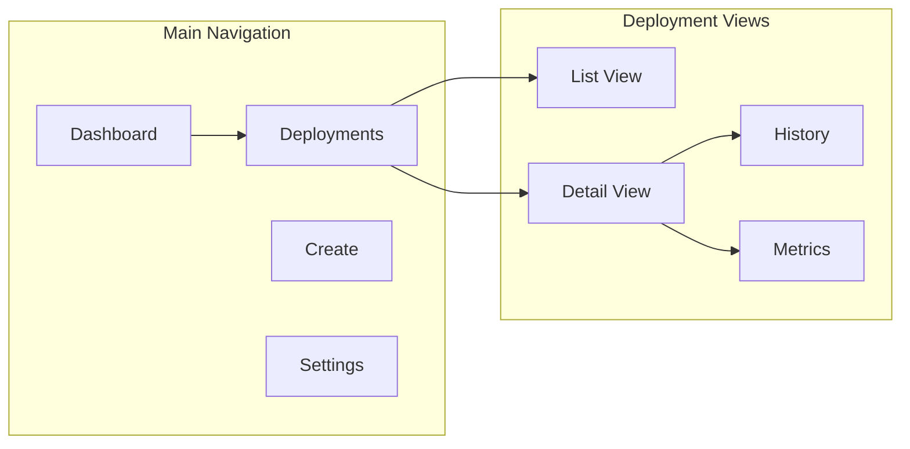

### Main Areas

```
┌─────────────────────────────────────────────────────────────────┐
│  Navigation Bar                                    [User] [⚙️]   │
├─────────────────────────────────────────────────────────────────┤
│                                                                  │
│  ┌─────────────────────────────────────────────────────────┐   │
│  │                                                         │   │
│  │  Main Content Area                                     │   │
│  │                                                         │   │
│  │  - Deployments List                                    │   │
│  │  - Deployment Details                                  │   │
│  │  - Create Deployment Form                              │   │
│  │                                                         │   │
│  └─────────────────────────────────────────────────────────┘   │
│                                                                  │
│  ┌─────────────────────────────────────────────────────────┐   │
│  │  Status Bar / Notifications                             │   │
│  └─────────────────────────────────────────────────────────┘   │
│                                                                  │
└─────────────────────────────────────────────────────────────────┘
```

---

## Deployments List

### List View Features

The deployments list provides an overview of all deployments with filtering and sorting capabilities.

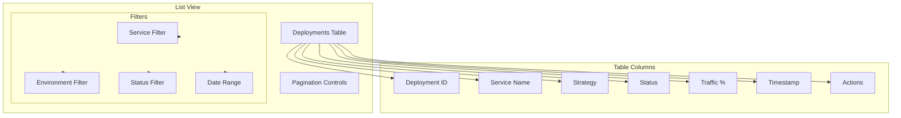

### Status Indicators

| Status | Color | Icon | Description |
|--------|-------|------|-------------|
| Pending | Gray | ⏳ | Deployment created, not started |
| In Progress | Blue | 🔄 | Deployment actively running |
| Paused | Yellow | ⏸️ | Deployment paused at current step |
| Completed | Green | ✅ | Deployment successfully completed |
| Failed | Red | ❌ | Deployment failed |
| Rolled Back | Orange | ↩️ | Deployment was rolled back |

### Filtering Options

**By Service:**
- Select from dropdown of available services
- Free-text search

**By Environment:**
- Development
- Staging
- Production

**By Status:**
- All
- Active (in_progress, paused)
- Completed
- Failed

### Quick Actions

From the list view, you can:

| Action | Icon | Description |
|--------|------|-------------|
| View | 👁️ | Open deployment details |
| Start | ▶️ | Start a pending deployment |
| Pause | ⏸️ | Pause an in-progress deployment |
| Rollback | ↩️ | Rollback the deployment |

---

## Deployment Detail View

### Detail View Components

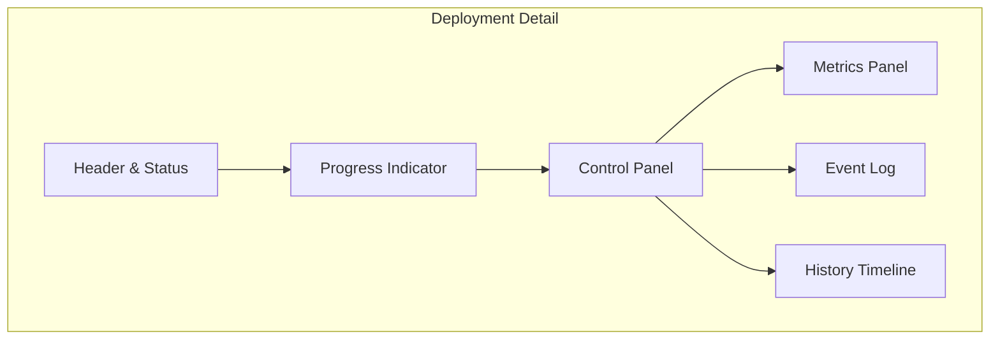

### Header Section

Displays key deployment information:

```
┌─────────────────────────────────────────────────────────────────┐
│  📦 news-api-canary-20240101120000                              │
│                                                                  │
│  Service: news-api          Strategy: Canary                   │
│  Environment: production    Version: v2.0.0                    │
│  Created by: admin          Started: 2024-01-01 12:00:00       │
│                                                                  │
│  Status: [■■■■■□□□□□] IN PROGRESS - 50% Traffic                │
└─────────────────────────────────────────────────────────────────┘
```

### Progress Visualization

#### Canary Deployment Progress

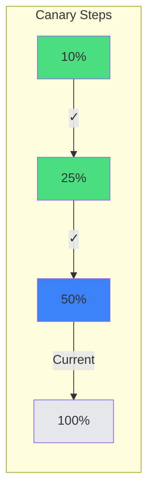

Visual representation:
```
Step Progress: [===✓===][===✓===][===◉===][       ]
               10%      25%      50%      100%
                                 ↑
                            Current Step
```

#### Blue-Green Deployment Progress

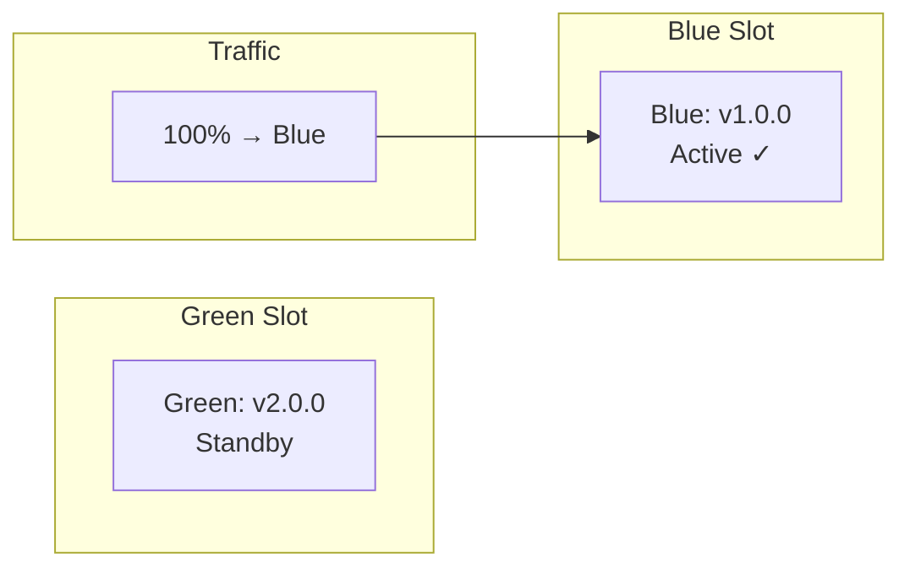

### Control Panel

Interactive controls for managing the deployment:

```
┌─────────────────────────────────────────────────────────────────┐
│  Deployment Controls                                            │
│                                                                  │
│  [▶️ Start]  [⏸️ Pause]  [▶️ Resume]  [↩️ Rollback]  [⏩ Promote] │
│                                                                  │
│  Reason (optional): [________________________]                  │
└─────────────────────────────────────────────────────────────────┘
```

| Control | Description | Available When |
|---------|-------------|----------------|
| Start | Begin deployment execution | Status: pending |
| Pause | Pause at current step | Status: in_progress |
| Resume | Continue from paused state | Status: paused |
| Rollback | Revert to previous version | Status: in_progress, paused |
| Promote | Skip to 100% immediately | Status: in_progress, paused (canary only) |
| Switch | Switch blue/green slots | Strategy: blue_green |

### Metrics Panel

Real-time metrics visualization:

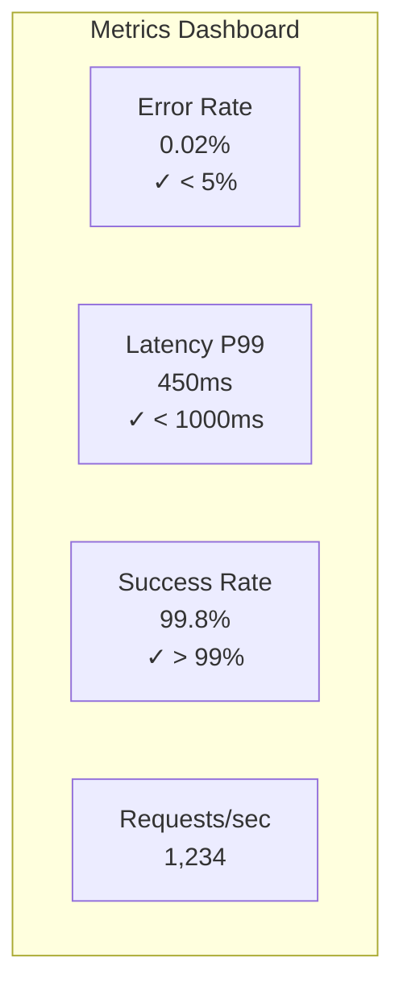

#### Metric Cards

```
┌──────────────┐ ┌──────────────┐ ┌──────────────┐ ┌──────────────┐
│ Error Rate   │ │ Latency P99  │ │ Success Rate │ │ Requests/s   │
│              │ │              │ │              │ │              │
│   0.02%      │ │   450ms      │ │   99.8%      │ │   1,234      │
│   ✓ healthy  │ │   ✓ healthy  │ │   ✓ healthy  │ │              │
│ threshold:5% │ │ threshold:1s │ │ threshold:99%│ │              │
└──────────────┘ └──────────────┘ └──────────────┘ └──────────────┘
```

### Event Log

Real-time event stream:

```
┌─────────────────────────────────────────────────────────────────┐
│  Event Log                                            [Filter ▾] │
├─────────────────────────────────────────────────────────────────┤
│  12:30:00  INFO   Traffic shifted to 50%                  system │
│  12:25:00  INFO   Metrics check passed                    system │
│  12:20:00  INFO   Traffic shifted to 25%                  system │
│  12:15:00  INFO   Metrics check passed                    system │
│  12:10:00  INFO   Traffic shifted to 10%                  system │
│  12:01:00  INFO   Deployment started                       admin │
│  12:00:00  INFO   Deployment created                       admin │
└─────────────────────────────────────────────────────────────────┘
```

### History Timeline

State change history:

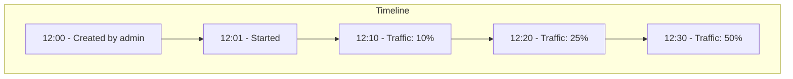

---

## Creating Deployments

### Create Deployment Form

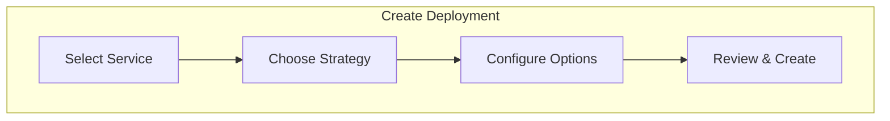

### Form Fields

#### Basic Configuration

| Field | Type | Required | Description |
|-------|------|----------|-------------|
| Service Name | Text/Select | Yes | Service to deploy |
| Target Version | Text | Yes | Version to deploy |
| Environment | Select | Yes | development, staging, production |
| Strategy | Select | Yes | canary or blue_green |

#### Canary Options

| Field | Type | Default | Description |
|-------|------|---------|-------------|
| Traffic Steps | Text | 10,25,50,100 | Comma-separated percentages |
| Auto-Start | Toggle | Off | Start immediately after creation |

#### Metrics Configuration

| Field | Type | Default | Description |
|-------|------|---------|-------------|
| Error Rate | Number | 0.05 | Maximum acceptable error rate |
| Latency P99 | Number | 1000 | Maximum P99 latency (ms) |
| Success Rate | Number | 0.99 | Minimum success rate |

### Create Deployment Flow

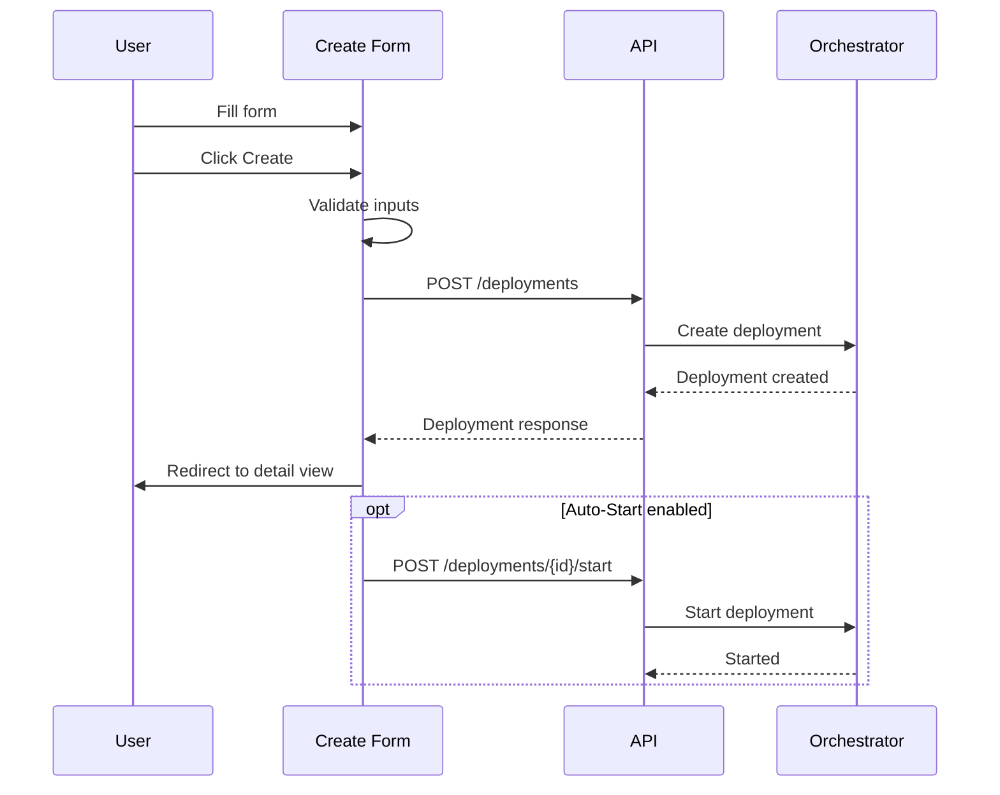

---

## Real-Time Updates

### WebSocket Connection

The dashboard maintains a WebSocket connection for real-time updates:

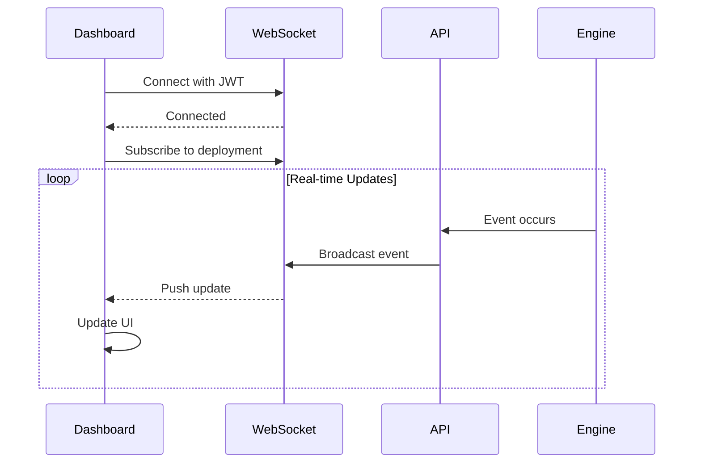

### Update Types

| Update Type | Description | UI Action |
|-------------|-------------|-----------|
| deployment_update | Status/traffic changed | Update status, progress |
| metrics_update | New metrics available | Update metrics cards |
| event | New event occurred | Add to event log |
| error | Error occurred | Show notification |

### Connection Status

The dashboard shows connection status:

| Status | Indicator | Description |
|--------|-----------|-------------|
| Connected | 🟢 | Real-time updates active |
| Connecting | 🟡 | Attempting to connect |
| Disconnected | 🔴 | No real-time updates |
| Reconnecting | 🟡 | Auto-reconnecting |

---

## Settings & Preferences

### User Settings

| Setting | Options | Description |
|---------|---------|-------------|
| Theme | Light/Dark/System | UI theme preference |
| Notifications | On/Off | Browser notifications |
| Auto-refresh | On/Off | Fallback when WS disconnected |
| Refresh Interval | 10-60s | Auto-refresh interval |

### Dashboard Preferences

| Setting | Options | Description |
|---------|---------|-------------|
| Default View | List/Grid | Preferred list layout |
| Items per Page | 10/25/50/100 | Pagination size |
| Default Environment | All/Dev/Staging/Prod | Default filter |

---

## Keyboard Shortcuts

| Shortcut | Action |
|----------|--------|
| `g` + `d` | Go to Deployments |
| `g` + `c` | Go to Create |
| `r` | Refresh current view |
| `/` | Focus search |
| `Esc` | Close modal/cancel |
| `?` | Show keyboard shortcuts |

---

## Mobile Experience

The dashboard is responsive and works on mobile devices:

```
┌─────────────────────┐
│  ≡  ADO Dashboard   │
├─────────────────────┤
│                     │
│  Deployments        │
│  ─────────────────  │
│                     │
│  ┌───────────────┐  │
│  │ news-api      │  │
│  │ canary        │  │
│  │ ▓▓▓▓░░ 50%    │  │
│  │ in_progress   │  │
│  └───────────────┘  │
│                     │
│  ┌───────────────┐  │
│  │ auth-service  │  │
│  │ blue_green    │  │
│  │ ✓ completed   │  │
│  └───────────────┘  │
│                     │
│  [+] New Deployment │
└─────────────────────┘
```

---

## Troubleshooting

### Common Issues

| Issue | Cause | Solution |
|-------|-------|----------|
| Can't login | Invalid credentials | Check username/password |
| No real-time updates | WebSocket disconnected | Check network, refresh page |
| Deployment not showing | Filter hiding it | Clear filters |
| Controls disabled | Insufficient permissions | Contact admin |
| Slow loading | Network issues | Check API connectivity |

### Connection Issues

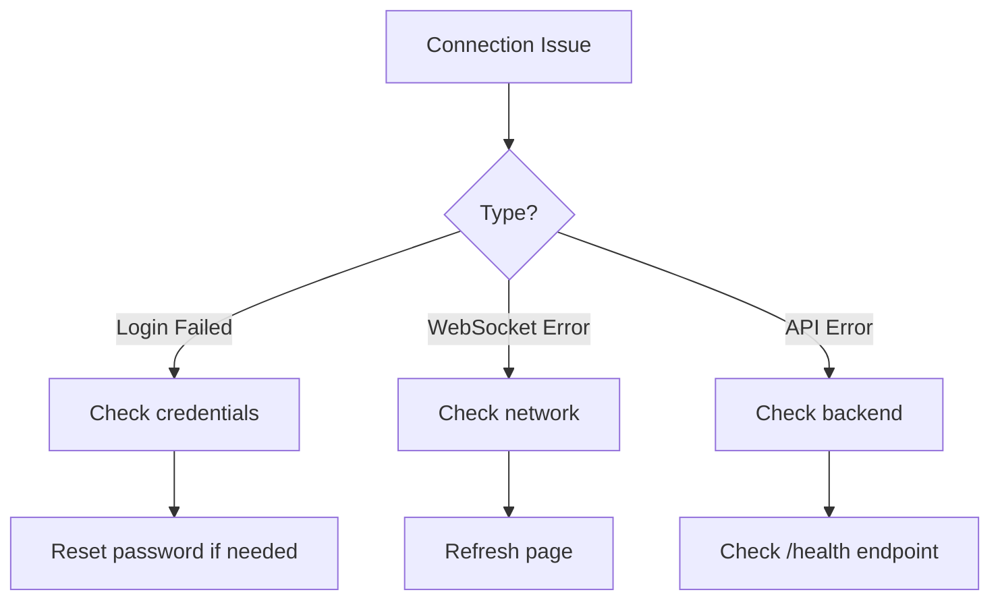

### Browser Compatibility

| Browser | Minimum Version | Status |
|---------|-----------------|--------|
| Chrome | 90+ | ✅ Full Support |
| Firefox | 88+ | ✅ Full Support |
| Safari | 14+ | ✅ Full Support |
| Edge | 90+ | ✅ Full Support |

### Performance Tips

1. **Use filters** - Reduce displayed deployments
2. **Close unused tabs** - Free up WebSocket connections
3. **Clear browser cache** - If UI behaves unexpectedly
4. **Check network** - Slow loading may indicate network issues

---

## Role-Based Views

### Admin View

Admins see all features:
- All deployments across environments
- User management section
- System configuration
- Audit logs

### Operator View

Operators see:
- Deployments they have access to
- Create/control deployments
- View metrics and events
- No user management

### Viewer View

Viewers see:
- Read-only deployment list
- View deployment details
- View metrics (read-only)
- No control actions

---

## Integration with Other Tools

### Opening from CLI

```bash
# Open dashboard for a specific deployment
adaptive-deploy status --deployment news-api-canary-20240101120000 --open-dashboard
```

### Linking from CI/CD

Include dashboard links in CI/CD notifications:

```yaml
# Example Slack notification
- name: Notify with Dashboard Link
  run: |
    DASHBOARD_URL="https://dashboard.example.com/deployments/${DEPLOYMENT_ID}"
    curl -X POST $SLACK_WEBHOOK -d "{
      \"text\": \"Deployment in progress\",
      \"attachments\": [{
        \"actions\": [{
          \"type\": \"button\",
          \"text\": \"View in Dashboard\",
          \"url\": \"${DASHBOARD_URL}\"
        }]
      }]
    }"
```

---

## See Also

- [API Reference](./API.md)
- [CLI Reference](./CLI.md)
- [Architecture Guide](./ARCHITECTURE.md)
- [Deployment Guide](./DEPLOYMENT.md)
